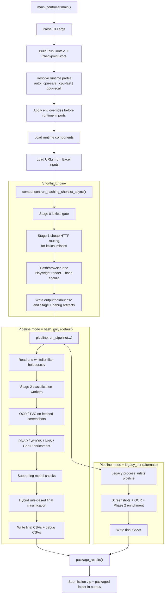

# Current Runtime Architecture and Throughput

This is the canonical engineer-facing description of the runtime that is currently exercised by [`main_controller.py`](../main_controller.py).

It consolidates the parts of the implementation that matter when you need to:

- understand the live control flow end to end
- find the real entrypoints and handoff boundaries
- tune throughput without guessing
- distinguish the default `hash_only` path from the alternate `legacy_ocr` path
- distinguish shortlist execution mode from pipeline mode, which are separate axes

Older docs in `docs/` are still useful as historical snapshots, but several of them only describe one slice of the system. In particular, `PIPELINE_ARCHITECTURE_BRIEF.md`, `concurrency_architecture.md`, and `codebase_context.md` do not fully capture the current controller-driven runtime as implemented today.

## 1. Runtime Summary

The top-level orchestrator is `main_controller.main()`.

At a high level the controller does this:

1. parse CLI arguments
2. build resume / reliability context and checkpoint store
3. resolve and apply a runtime profile
4. import runtime components after env overrides are set
5. run the shortlist engine from `phishing_pipeline.comparison`
6. persist `output/holdout.csv`
7. run `phishing_pipeline.pipeline.run_pipeline(...)`
8. package final outputs

The default downstream pipeline mode is `hash_only`.

That default path currently looks like this:

`main()` -> runtime profile -> manifest / resume setup -> Stage 0 lexical gate -> Stage 1 cheap HTTP routing -> hash/browser lane -> `output/holdout.csv` -> Stage 2 `hash_only` classification -> packaging

Important: there are **two different mode-selection axes**.

| Axis | Control | Values | Meaning |
| --- | --- | --- | --- |
| Shortlist execution mode | `PHISHING_SHORTLIST_EXECUTION_MODE` | `streaming-concurrent`, `legacy-batch` | Controls how `comparison.run_hashing_shortlist_streaming(...)` overlaps Stage 0, Stage 1, and the hash/browser lane |
| Pipeline mode | `--pipeline-mode` | `hash_only`, `legacy_ocr` | Controls which downstream analysis path runs after `holdout.csv` exists |

These are not the same thing. A run can use:

- `hash_only` pipeline mode with `streaming-concurrent` shortlist execution
- `hash_only` pipeline mode with `legacy-batch` shortlist execution
- `legacy_ocr` pipeline mode after the same shortlist stage has already produced `holdout.csv`

## 2. End-to-End Runtime Flow

## 3. Major Entrypoints and Handoffs

| Entrypoint | Role in runtime |
| --- | --- |
| `main_controller.main()` | CLI controller, runtime-profile resolution, resume handling, cleanup, shortlist invocation, pipeline invocation, packaging |
| `comparison.run_hashing_shortlist_async()` | Async controller-facing shortlist entrypoint |
| `comparison.run_hashing_shortlist_streaming()` | Selects shortlist execution mode and orchestrates Stage 0 and Stage 1 routing before hash scoring |
| `comparison._run_hashing_shortlist_streaming_concurrent()` | Primary concurrent shortlist engine used when `PHISHING_SHORTLIST_EXECUTION_MODE=streaming-concurrent` |
| `comparison._run_stage1_http_pipeline()` | Cheap HTTP routing pipeline with fetch, parse, score, enrich, and finalize lanes |
| `pipeline.run_pipeline()` | Reads `holdout.csv`, filters against whitelist, then dispatches to `hash_only` or `legacy_ocr` downstream processing |
| `pipeline._run_hash_only_pipeline()` | Current default Stage 2 classification path |
| `pipeline.process_urls()` | Legacy OCR extraction pipeline used only when `--pipeline-mode legacy_ocr` |
| `pipeline.package_results()` | Converts final CSV to submission Excel shape and packages evidence + Excel into the submission zip |

## 4. Current Default Path: `hash_only`

### 4.1 Controller startup and runtime profiles

`main_controller.py` resolves a runtime profile first and applies env overrides before importing the heavy runtime modules.

That matters because:

- `phishing_pipeline.comparison` reads many `PHISHING_HASH_*` and `PHISHING_LEXICAL_*` values at import time
- `phishing_pipeline.utils` reads legacy OCR concurrency values at import time
- `STAGE1_HTTP_CONFIG` is then updated in memory by the controller with the selected Stage 1 preset values

Built-in profiles:

| Profile | Shortlist execution mode | Hash pages | Stage 1 fetch start/max/floor | Stage 1 CPU workers |
| --- | --- | --- | --- | --- |
| `cpu-safe` | `legacy-batch` | 16 | `96 / 192 / 32` | 4 |
| `cpu-fast` | `streaming-concurrent` | 24 | `192 / 384 / 48` | 6 |
| `cpu-recall` | `streaming-concurrent` | 64 | `192 / 512 / 64` | 24 |

`auto` resolves to one of the profiles above based on CPU cores, RAM, and VRAM.

### 4.2 Stage 0 lexical gate

Stage 0 is implemented inside `comparison.run_hashing_shortlist_streaming(...)`.

Its job is to score URL/domain candidates before any heavier network or browser work. The main methods are:

- URL normalization
- typo / lexical similarity scoring
- candidate generation against the entity index
- lexical thresholding to separate obvious hits from lexical misses

Operationally:

- lexical hits are admitted directly into the shortlist candidate set
- lexical misses are sent to Stage 1 cheap HTTP routing
- the lexical executor may use a process pool or a thread pool depending on `PHISHING_SHORTLIST_CPU_EXECUTOR_MODE`

On `streaming-concurrent`, Stage 0 overlaps with downstream work. On `legacy-batch`, Stage 0 completes first and Stage 1 analysis happens afterward.

### 4.3 Stage 1 cheap HTTP routing

Stage 1 is the cheap HTTP analyzer for lexical misses. It is implemented around `comparison._run_stage1_http_pipeline(...)` and `stage1_http_analyzer.py`.

It is a multi-lane async routing stage with these logical workers:

- fetch workers
- parse workers
- score workers
- enrich workers
- finalize worker

What it tries to answer:

- does the HTTP response or HTML indicate brand impersonation?
- are there form, redirect, auth-term, or certificate/provider signals that justify escalation?
- should this lexical miss be escalated to the more expensive hash/browser lane?

What it uses:

- HTTP HEAD/GET probes through `httpx`
- HTML parsing and feature extraction
- DNS, RDAP, and TLS enrichment
- Stage 1 scoring thresholds from `STAGE1_HTTP_CONFIG`

Its outputs are stored in `stage1_analysis_map` and then folded back into shortlist admission decisions.

### 4.4 Hash/browser lane

The shortlist hash lane is implemented in `comparison.py` after Stage 1 routing admits URLs for deeper inspection.

The high-cost part here is browser-based rendering and payload extraction, not GPU OCR.

The lane uses:

- long-lived browser shards
- per-host limits
- render and auxiliary queues
- an adaptive fetch limiter that can downshift active page concurrency under pressure
- a finalizer called `_gpu_microbatch_scorer(...)`

Important naming note: `_gpu_microbatch_scorer(...)` batches finalization work, but the current implementation is not the same kind of GPU-bound OCR stage used by the legacy OCR path. The shortlist bottleneck here is primarily Playwright/network/RAM pressure and queue backpressure.

Main shortlist outputs:

- `output/holdout.csv`
- `output/hashing_shortlist.log`
- `output/stage1_lexical_debug.csv`
- `output/stage1_methods_debug.csv`
- `output/stage1_deep_analysis_candidates.csv`
- `output/fetch_failed_lexical_hits.csv`
- `output/hashing_shortlist_excluded_urls.csv`
- `output/hash_folder/*.csv`

### 4.5 Stage 2 `hash_only` classification

After `holdout.csv` exists, `pipeline.run_pipeline(...)` filters it against the whitelist and, for the default mode, dispatches to `pipeline._run_hash_only_pipeline(...)`.

This is the current default downstream classification path.

Per shortlisted row, the path does some or all of:

- classify non-fetched rows using lexical/hash evidence only
- run OCR/TVC on fetched screenshots through `_extract_hash_only_ocr_tvc(...)`
- enrich with RDAP, WHOIS fallback, DNS, and GeoIP
- build a model frame for supporting brand/domain model checks
- apply `_hybrid_hash_decision(...)` for final output / review routing

Main outputs from this stage:

- `output/output_file.csv`
- `output/output_file_filtered.csv`
- `output/stage2_model_debug.csv`
- `output/stage3_classification_debug.csv`
- `output/hash_review_queue.csv`

### 4.6 Packaging and reliability artifacts

At the end of a successful controller run:

- `pipeline.package_results()` converts the final CSV to the submission Excel schema
- evidence files are copied into the packaged submission folder
- a zip is written under `output/`

Reliability / resumability artifacts are maintained alongside the data path:

- `output/checkpoints.csv`
- `output/run_manifest.csv`
- `output/pipeline_run_results.csv`
- `output/pipeline_stage_events.csv`

These are part of the runtime contract, not just debugging leftovers.

## 5. Alternate Path: `legacy_ocr`

`legacy_ocr` is not a separate shortlist system. It is an alternate downstream processing mode after shortlist generation.

Controller behavior is still:

1. run shortlist
2. write `output/holdout.csv`
3. call `pipeline.run_pipeline(...)`
4. branch inside `run_pipeline(...)` because `pipeline_mode == legacy_ocr`

The legacy OCR path centers on `pipeline.process_urls(...)`.

Its extraction pipeline is:

- Stage 1 screenshot + network extraction
- Queue 1 from screenshot workers to OCR workers
- Stage 2 OCR / branding / laplacian / TVC
- Queue 2 into Phase 2 RDAP / WHOIS / DNS / GeoIP / classification workers

The GPU-sensitive part of this mode lives in `visual_features.py`:

- `preprocess_image_for_ocr(...)` is CPU-only
- `run_ocr_inference(...)` is GPU-serialized under `_ocr_lock`
- `wait_for_vram(...)` guards OCR execution
- `ResourceMonitor` throttles on high CPU, RAM, or GPU load

This is still useful for maintenance and comparison, but it is not the recommended tuning target for the current default runtime.

## 6. Throughput and Backpressure Model

### 6.1 Shortlist engine backpressure

The primary shortlist path on `streaming-concurrent` uses natural queue backpressure rather than a single giant fan-out.

Implications:

- if Stage 1 enrich is slow, upstream fetch/parse workers eventually stall behind bounded queues
- if browser rendering is slow, admitted URLs pile up before final shortlist scoring
- if Stage 2 classification is slow, it does not directly slow shortlist generation in the controller path because `holdout.csv` is materialized between them
- the adaptive fetch limiter is only part of the shortlist engine, not the downstream `hash_only` classifier

### 6.2 Dominant resource types by stage

| Stage | Primary resource pressure | Notes |
| --- | --- | --- |
| Stage 0 lexical gate | CPU | Parallel lexical scoring and candidate generation |
| Stage 1 cheap HTTP routing | Network + CPU | HTTP probes, HTML parse, DNS/RDAP/TLS enrich, queue coordination |
| Hash/browser lane | Network + RAM + Playwright process overhead | Browser shards, page concurrency, screenshot/render extraction, per-host limits |
| `hash_only` OCR/TVC | CPU and optionally GPU | OCR is conditional on fetched screenshots and is downstream of shortlist admission |
| `hash_only` infra enrich | Network | RDAP first, WHOIS fallback, DNS, GeoIP |
| `hash_only` model checks | CPU | Supporting models only, not the shortlist bottleneck |
| `legacy_ocr` path | RAM + GPU + Playwright | Screenshot concurrency plus serialized GPU OCR under `_ocr_lock` |

### 6.3 Concurrency source-of-truth and precedence

Today concurrency is controlled from multiple places:

1. static defaults in `phishing_pipeline.config`
2. runtime profile selection in `main_controller.py`
3. env-driven import-time constants in `comparison.py`
4. env-driven import-time constants in `utils.py`
5. in-memory mutation of `STAGE1_HTTP_CONFIG` by the controller
6. explicit CLI overrides for Stage 1 thresholds and shortlist scoring

The practical precedence is:

1. controller chooses a runtime profile
2. controller exports env vars
3. controller imports comparison / utils so import-time constants see the env
4. controller mutates `STAGE1_HTTP_CONFIG`
5. CLI threshold flags are passed through to shortlist scoring / routing

This works, but it is not a single-source-of-truth design. Some values are frozen at import time while others remain mutable at runtime.

### 6.4 Throughput benchmarks and what they validate

`scripts/benchmark_shortlist_streaming.py` is a synthetic shortlist benchmark.

It validates overlap between:

- Stage 0 lexical streaming
- Stage 1 cheap HTTP routing
- hash/browser lane finalization

It does **not** validate:

- true network latency against external services
- end-to-end `hash_only` Stage 2 classification cost
- end-to-end `legacy_ocr` GPU behavior
- packaging throughput

Use it to reason about shortlist overlap and queue behavior, not to estimate full controller runtime by itself.

## 7. Operational Interfaces

### 7.1 High-value CLI flags

| Interface | Purpose |
| --- | --- |
| `--pipeline-mode` | Select `hash_only` or `legacy_ocr` downstream processing |
| `--runtime-profile` | Select `auto`, `cpu-safe`, `cpu-fast`, or `cpu-recall` |
| `--stage-smoke-test` | Stop after shortlist stages or run classification only on an existing holdout |
| `--resume` / `--force-reprocess` | Control resumability and checkpoint reuse |
| `--run-id` | Pin or reuse a reliability run identifier |
| `--stage1-failure-policy` | Decide how Stage 1 cheap HTTP failures are routed |
| `--hashing-threshold` | Final shortlist threshold |
| `--domain-sim-threshold` | Domain similarity contribution gate |
| `--high-confidence-threshold` / `--medium-confidence-threshold` | Confidence band boundaries |
| `--typo-top-k`, `--typo-min-score`, `--lexical-pass-min-score` | Stage 0 lexical scoring controls |
| `--stage1-escalate-total-threshold`, `--stage1-brand-min`, `--stage1-credential-min`, `--stage1-low-band-min`, `--stage1-hard-trigger-brand-min` | Stage 1 cheap HTTP routing overrides |
| `--keep-stage1-suspected`, `--keep-fetch-failed-strict-lexical` | Admit weak candidates into later review / downstream stages |
| `--failed-fetch-suspected-min`, `--failed-fetch-review-min` | Rescue thresholds for non-fetched strict-lexical rows |
| `--weight-domain`, `--weight-favicon`, `--weight-ssl-hash`, `--weight-html-hash`, `--weight-domain-hash`, `--weight-keywords` | Shortlist scoring weights |

### 7.2 Environment variables: shortlist and hash lane

These are the main tuning knobs read by `comparison.py`.

| Group | Variables |
| --- | --- |
| Shortlist execution mode | `PHISHING_SHORTLIST_EXECUTION_MODE`, `PHISHING_SHORTLIST_CPU_EXECUTOR_MODE` |
| Hash topology | `PHISHING_HASH_PAGES`, `PHISHING_HASH_PAGE_CONCURRENCY`, `PHISHING_HASH_ACTIVE_PAGES_FLOOR` |
| Hash network and timeouts | `PHISHING_HASH_HTTP_LIMIT`, `PHISHING_HASH_AUX_NET_LIMIT`, `PHISHING_HASH_AUX_SSL_LIMIT`, `PHISHING_HASH_NAV_TIMEOUT_MS`, `PHISHING_HASH_SCREENSHOT_TIMEOUT_MS`, `PHISHING_HASH_FETCH_TIMEOUT_S`, `PHISHING_HASH_PER_HOST_LIMIT` |
| Queueing and pressure | `PHISHING_HASH_RESULT_QUEUE_MAX`, `PHISHING_HASH_RENDER_QUEUE_MAX`, `PHISHING_GPU_QUEUE_MAXSIZE`, `PHISHING_GPU_MAX_WAIT_MS`, `PHISHING_GPU_BATCH_SIZE`, `PHISHING_HASH_TARGET_URLS_PER_SEC`, `PHISHING_HASH_PROGRESS_LOG_INTERVAL_SECONDS`, `PHISHING_HASH_ADAPTIVE_DOWNSHIFT` |
| Lexical stage | `PHISHING_LEXICAL_WORKERS`, `PHISHING_LEXICAL_BATCH_SIZE`, `PHISHING_LEXICAL_INFLIGHT_BATCHES`, `PHISHING_LEXICAL_PROGRESS_INTERVAL_S` |
| Hardware probe override | `PHISHING_GPU_VRAM_GB` |

### 7.3 Environment variables: legacy OCR path

These are read by `utils.py` and primarily matter for the `legacy_ocr` path:

- `PHISHING_OCR_WORKERS`
- `PHISHING_SCREENSHOT_WORKERS`
- `PHISHING_IMAGE_WORKERS`
- `PHISHING_CPU_TASKS`
- `PHISHING_CHUNK_SIZE`
- `PHISHING_RDAP_WORKERS`
- `PHISHING_WHOIS_WORKERS`
- `PHISHING_DNS_PREFILTER_WORKERS`
- `PHISHING_NETWORK_SEMAPHORE`

### 7.4 Output and checkpoint artifacts

| Artifact | Purpose |
| --- | --- |
| `output/holdout.csv` | Materialized shortlist handoff into downstream pipeline processing |
| `output/output_file.csv` | Main final output |
| `output/output_file_filtered.csv` | Flagged-only final output |
| `output/stage1_lexical_debug.csv` | Stage 1 lexical/routing debug |
| `output/stage1_methods_debug.csv` | Stage 1 method-level audit |
| `output/stage1_deep_analysis_candidates.csv` | Deep-analysis candidate audit |
| `output/fetch_failed_lexical_hits.csv` | Strict-lexical rows that failed fetch |
| `output/hashing_shortlist_excluded_urls.csv` | Rows excluded before final shortlist |
| `output/hashing_shortlist.log` | Shortlist execution log |
| `output/stage2_model_debug.csv` | Supporting model debug for `hash_only` |
| `output/stage3_classification_debug.csv` | Final classification debug for `hash_only` |
| `output/hash_review_queue.csv` | Review sink output |
| `output/checkpoints.csv` | Runtime checkpoint / resumability data |
| `output/run_manifest.csv` | Run manifest and compatibility data |
| `output/pipeline_run_results.csv` | Pipeline result summaries |
| `output/pipeline_stage_events.csv` | Stage event history |
| `output/Submission-*.zip` | Packaged submission artifact |

## 8. Current vs Legacy

| Concern | Current default runtime | Alternate legacy runtime |
| --- | --- | --- |
| Controller default | `--pipeline-mode hash_only` | `--pipeline-mode legacy_ocr` |
| Shortlist prerequisite | Always runs first | Always runs first |
| Primary downstream entrypoint | `_run_hash_only_pipeline(...)` | `process_urls(...)` plus legacy Phase 2 workers |
| Dominant bottlenecks | Stage 1 cheap HTTP plus Playwright shortlist rendering; then Stage 2 infra enrich / OCR on admitted rows | Screenshot concurrency, Queue 1 pressure, serialized OCR under `_ocr_lock`, Phase 2 network enrich |
| GPU sensitivity | Limited to fetched-row OCR/TVC in Stage 2 | Core part of the pipeline due to centralized OCR stage |
| Queue shape | Stage 1 multi-lane queues plus shortlist render/finalize queues; `holdout.csv` is the materialized boundary before classification | Queue 1 from screenshot to OCR, Queue 2 from OCR to Phase 2 enrich/classify |
| Runtime tuning focus | shortlist execution mode, Stage 1 HTTP concurrency, browser shard limits, Stage 2 enrich throughput | screenshot workers, OCR workers, VRAM gate, resource monitor thresholds |
| Recommended optimization target | Yes | Only for maintenance or comparison |

One more distinction is easy to miss:

- `legacy_ocr` is a **pipeline mode**
- `legacy-batch` is a **shortlist execution mode**

They are related only historically, not structurally.

## 9. Prioritized Throughput Backlog

### P0. Unify concurrency source of truth

Problem:

- concurrency and backpressure live across controller runtime profiles, config defaults, import-time env reads, and in-memory config mutation

Why it matters:

- tuning is error-prone
- docs and code can drift
- some values are fixed at import and others are mutable later

Recommendation:

- define one canonical runtime settings object and make both shortlist and downstream stages consume it explicitly
- keep env overrides as input to that object, not as hidden side channels

### P1. Standardize stage telemetry

Problem:

- queue depths, worker saturation, and latency are logged in different shapes across shortlist and pipeline stages

Why it matters:

- throughput debugging becomes log archaeology
- benchmarks cannot be compared cleanly across stages

Recommendation:

- standardize per-stage metrics for queue depth, throughput, p50/p95 latency, retries, timeouts, and active-worker counts
- emit them with consistent keys across Stage 0, Stage 1, hash lane, and downstream classification

### P2. Separate tuning guidance for shortlist vs downstream pipeline

Problem:

- some older docs mix shortlist bottlenecks with legacy OCR bottlenecks

Why it matters:

- engineers tune the wrong subsystem
- the default runtime appears more GPU-bound than it actually is

Recommendation:

- treat shortlist throughput and downstream `hash_only` classification throughput as separate tuning chapters
- keep `legacy_ocr` tuning isolated to maintenance guidance

### P3. Make expensive work more conditional

Problem:

- multiple forms of enrichment and analysis are still spread across routing, shortlist finalization, and downstream classification

Why it matters:

- expensive work can happen before enough evidence exists to justify it
- cost attribution is harder

Recommendation:

- document and then tighten which operations are always-on, which are admission-gated, and which should be strictly post-admission only

### P4. Reduce duplicated enrichment logic

Problem:

- the codebase contains multiple enrichment paths and multiple points where RDAP, DNS, OCR/TVC, and classification-related fields are assembled

Why it matters:

- duplicated logic obscures the true critical path
- instrumentation and caching are harder to add consistently

Recommendation:

- converge duplicated enrich steps behind shared helpers with clearly named handoff contracts
- keep one authoritative representation for “shortlist evidence” and one for “final classification evidence”

## 10. What to Read Next

When tracing the runtime in code, start here in order:

1. [`main_controller.py`](../main_controller.py)
2. [`phishing_pipeline/comparison.py`](../phishing_pipeline/comparison.py)
3. [`phishing_pipeline/stage1_http_analyzer.py`](../phishing_pipeline/stage1_http_analyzer.py)
4. [`phishing_pipeline/pipeline.py`](../phishing_pipeline/pipeline.py)
5. [`phishing_pipeline/utils.py`](../phishing_pipeline/utils.py)
6. [`phishing_pipeline/visual_features.py`](../phishing_pipeline/visual_features.py)

That sequence matches the live runtime better than the older docs do.
