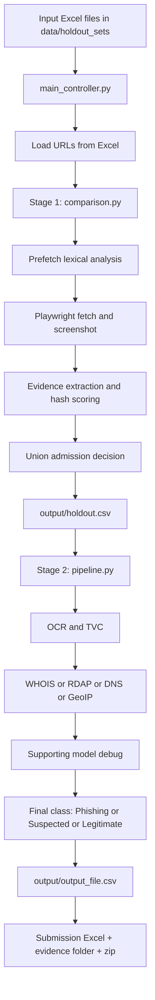
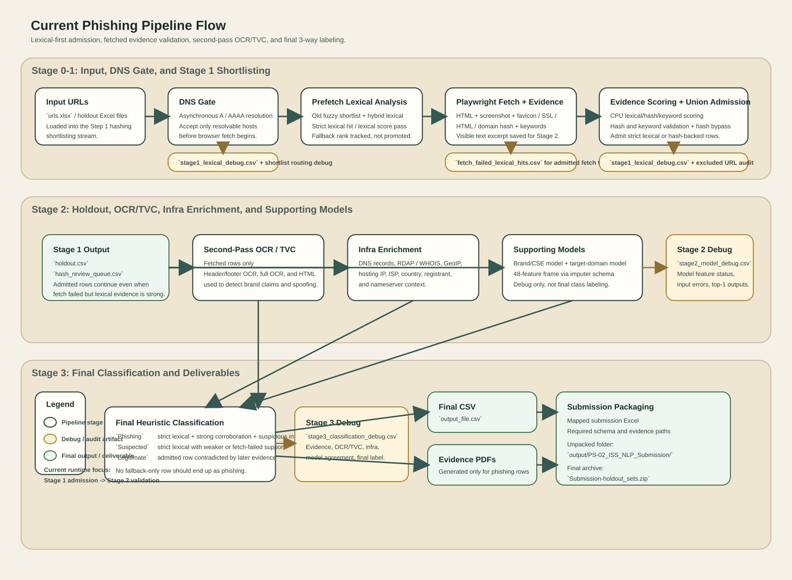

# Pipeline Architecture Brief

This document explains the current runtime architecture of the phishing pipeline, the major stages, the main artifacts written to `output/`, and the code paths that make the pipeline work.

It documents the live path used by `main_controller.py`, not the older experimental variants.

## 1. High-Level Architecture

The pipeline runs in three main layers:

1. `main_controller.py`
   - orchestrates the run
   - loads input URLs from Excel
   - runs Stage 1 shortlisting
   - runs Stage 2 classification and enrichment
   - packages the submission
2. `phishing_pipeline/comparison.py`
   - performs Stage 1 hashing-based shortlisting
   - runs prefetch lexical checks, browser fetch, hash collection, and Stage 1 evidence scoring
   - writes `output/holdout.csv`
3. `phishing_pipeline/pipeline.py`
   - performs Stage 2 enrichment and final labeling
   - runs OCR/TVC, WHOIS/RDAP/DNS/GeoIP enrichment, supporting model checks, and final classification
   - writes final CSVs and submission package

## 2. End-to-End Flow



Visual diagram:



## 3. Stage-by-Stage Explanation

### Stage 0: Controller Startup

`main_controller.py` imports the runtime components, clears stale outputs, reads the Excel files from `data/holdout_sets`, and starts the two-step flow.

Simplified orchestration:

```python
urls = shortlisting.load_urls_from_excel_folder(args.shortlisting, limit=args.target_limit)
holdout_df = await run_hashing_shortlist_async(list(urls), ...)
holdout_df.to_csv("output/holdout.csv", index=False)

df_out = await run_pipeline(
    holdout_folder=args.shortlisting,
    ps02_whitelist_file=args.whitelist,
    use_existing_holdout=True,
    ...
)

zip_path = package_results(zip_path=f"Submission-{input_name}.zip")
```

Code entrypoints:

- `main_controller.py`
- `run_hashing_shortlist_async(...)` in `phishing_pipeline/comparison.py`
- `run_pipeline(...)` in `phishing_pipeline/pipeline.py`
- `package_results(...)` in `phishing_pipeline/pipeline.py`

### Stage 1: Hashing-Based Shortlisting

Stage 1 decides which input URLs are worth carrying forward into the main pipeline.

It does not classify final phishing labels yet. It produces a shortlist with evidence fields.

#### 3.1 Prefetch lexical analysis

Before browser fetch, the pipeline computes lexical signals from the URL itself:

- old fuzzy shortlist logic
- hybrid lexical matcher
- brand token hits
- lexical score thresholds

This happens in:

- `_compute_prefetch_lexical_state(...)` in `phishing_pipeline/comparison.py`

Purpose:

- catch typo-like URLs early
- avoid depending only on fetched page evidence
- preserve strong lexical hits even when fetch quality is weak

#### 3.2 Playwright fetch and evidence extraction

For routed URLs, the pipeline opens the page and extracts:

- screenshot
- HTML
- favicon hash
- SSL hash
- domain hash
- visible text and keywords

The browser path is implemented in `_fetch_url_payload(...)`.

Simplified flow:

```python
payload = await _fetch_url_payload(url, ...)

# payload contains screenshot bytes, html, hashes, and page text
await gpu_queue.put(payload)
```

This stage is usually the most expensive part of the run because it is browser-bound.

#### 3.3 Stage 1 evidence scoring

Fetched rows are scored with the Stage 1 evidence set.

This happens in:

- `_gpu_microbatch_scorer(...)`

The active scoring path uses domain, favicon, SSL, HTML, domain-hash, and keyword signals.

It helps answer:

- does the page structurally or textually align with a known legitimate target?

It does not by itself produce a final phishing label.

#### 3.4 Union admission decision

The final Stage 1 decision is a union of strong signals:

- strict lexical hit
- lexical score pass
- exact hash bypass
- score-threshold pass

This is why Stage 1 is more robust than a pure screenshot shortlist.

Main outputs:

- `output/holdout.csv`
- `output/stage1_lexical_debug.csv`
- `output/fetch_failed_lexical_hits.csv`
- `output/hashing_shortlist_excluded_urls.csv`
- `output/hashing_shortlist.log`

### Stage 2: OCR, Enrichment, and Final Classification

Stage 2 consumes `output/holdout.csv` and turns shortlist rows into final report rows.

#### 4.1 OCR and TVC

For fetched rows with screenshots, the pipeline runs a second-pass OCR and TVC.

TVC means `Textual-Visual Consistency`.

It checks whether the brand text seen on the page aligns with the shortlisted CSE and whether that brand conflicts with the actual domain.

Relevant function:

```python
ocr_tvc = await _extract_hash_only_ocr_tvc(
    domain_url,
    screenshot_path,
    shortlisted_cse=...,
    shortlisted_domain=...,
    html_text=html_brand_text,
)
```

This stage helps answer:

- does the page claim to be a brand in the screenshot or OCR text?
- is that brand aligned with the shortlisted target?

#### 4.2 WHOIS, RDAP, DNS, and GeoIP enrichment

The pipeline then enriches each shortlisted URL with infrastructure data:

- resolved IP
- hosting ISP
- hosting country
- registrar
- registrant
- name servers
- DNS records

This produces the evidence needed for final decision-making and the final submission columns.

#### 4.3 Supporting models

The runtime also loads supporting models for debug and agreement signals:

- brand or CSE model
- target-domain model

Important:

- these are supporting signals only
- they do not directly produce the final `Phishing / Suspected / Legitimate` label

Outputs:

- `output/stage2_model_debug.csv`

#### 4.4 Final class labeling

Final labeling is rule-driven and evidence-based.

The core function is `_hybrid_hash_classification(...)`.

Key idea:

- `Phishing` requires strong lexical alignment plus stronger corroboration
- `Suspected` is used for partial but meaningful evidence
- `Legitimate` is used when the later evidence contradicts spoofing strongly enough

Simplified decision shape:

```python
if fallback_rank_only and not strict_lexical_hit:
    return "Legitimate"

if not lexical_survivor:
    return "Legitimate"

strong_direct_evidence = hash_anchor or tvc_brand_spoof_strong or content_spoof_strong

if fetched and strict_lexical_hit and strong_direct_evidence:
    return "Phishing"

if lexical_survivor and (weak_direct_evidence or parked_sale_signal or network_corroborated):
    return "Suspected"

return "Legitimate"
```

Main outputs:

- `output/output_file.csv`
- `output/hash_review_queue.csv`
- `output/stage3_classification_debug.csv`

### Stage 3: Submission Packaging

The final CSV is converted into the required submission Excel schema and packaged with evidence files.

This happens in `package_results(...)`.

Packaging creates:

- submission Excel
- evidence folder
- final zip archive

Simplified packaging shape:

```python
submission_df = pd.DataFrame(
    {
        "Identified Domain Name": ...,
        "Corresponding CSE Name": ...,
        "IP Address": ...,
        "Hosting ISP": ...,
        "Hosting Country": ...,
        "Registrant Name": ...,
        "Registrant Country": ...,
        "Name Servers": ...,
        "Evidence File Path": ...,
        "Source of Detection": ...,
        "Remarks": ...,
        "Phishing (Yes)": ...,
    }
)
```

Packaged output location:

- `output/PS-02_ISS_NLP_Submission/`

## 4. Main Artifacts Written by the Pipeline

| File | Purpose |
|---|---|
| `output/holdout.csv` | Stage 1 shortlist carried into Stage 2 |
| `output/hash_review_queue.csv` | Low-confidence admitted rows for manual review |
| `output/stage1_lexical_debug.csv` | Stage 1 lexical and admission debugging |
| `output/stage2_model_debug.csv` | Supporting model debug output |
| `output/stage3_classification_debug.csv` | Final classification debug trace |
| `output/hashing_shortlist_excluded_urls.csv` | Stage 1 exclusions with reason |
| `output/output_file.csv` | Final internal output CSV |
| `output/PS-02_ISS_NLP_Submission/` | Submission folder with Excel and evidence files |

## 5. Runtime Knobs That Matter

These knobs affect throughput, not the core decision logic.

Useful environment overrides for Stage 1:

```powershell
$env:PHISHING_HASH_PAGES = "72"
$env:PHISHING_HASH_PAGE_CONCURRENCY = "12"
$env:PHISHING_HASH_NAV_TIMEOUT_MS = "6000"
$env:PHISHING_HASH_SCREENSHOT_TIMEOUT_MS = "2000"
$env:PHISHING_HASH_FETCH_TIMEOUT_S = "8.0"
$env:PHISHING_HASH_HTTP_LIMIT = "192"
```

These control:

- total browser page pressure
- per-shard browser concurrency
- navigation and screenshot timeouts
- HTTP connection pressure

They do not change:

- lexical logic
- scoring weights
- classification thresholds
- output schema

## 6. How to Run the Current Pipeline

Example:

```powershell
python .\main_controller.py
```

Important inputs:

- holdout Excel files in `data/holdout_sets`
- whitelist file in `data/whitelists/Stage_2_Legitimate_Domains_80.xlsx`

## 7. Code Map

Use these functions when debugging or extending the pipeline:

- `main_controller.py`
  - `main()`
- `phishing_pipeline/comparison.py`
  - `_compute_prefetch_lexical_state(...)`
  - `_fetch_url_payload(...)`
  - `_gpu_microbatch_scorer(...)`
  - `run_hashing_shortlist_streaming(...)`
  - `run_hashing_shortlist_async(...)`
- `phishing_pipeline/pipeline.py`
  - `_extract_hash_only_ocr_tvc(...)`
  - `_hybrid_hash_classification(...)`
  - `_run_hash_only_pipeline(...)`
  - `run_pipeline(...)`
  - `package_results(...)`

## 8. Practical Reading Order

If you are new to the codebase, read it in this order:

1. `main_controller.py`
2. `phishing_pipeline/comparison.py`
3. `phishing_pipeline/pipeline.py`
4. `phishing_pipeline/utils.py`
5. `output/stage1_lexical_debug.csv`, `output/stage2_model_debug.csv`, and `output/stage3_classification_debug.csv`

That reading order matches the runtime flow and makes debugging much easier.
