# Pipeline Concurrency Architecture

## How the System Works — The 3-Stage Streaming Pipeline

All three stages run **concurrently** — Phase 2 RDAP starts the moment the first domain finishes OCR.

### Real-Time Operations Flow (with concurrency labels)

```mermaid
flowchart TB
    subgraph INPUT["INPUT"]
        A["All N Domains from holdout.csv"]
    end

    subgraph S1["STAGE 1 — Network + Screenshot"]
        direction TB
        B1["URL Features\nSSL / IP / DNS / Entropy"]
        B2["Screenshot\nPlaywright Browser"]
        B1 --> B2
    end

    subgraph Q1["QUEUE-1"]
        Q1A["Bounded Queue\nmaxsize = OCR workers × 2"]
    end

    subgraph S2["STAGE 2 — OCR + Visual (GPU)"]
        direction TB
        C1["Phase A: CPU Parallel\nPreprocess + Branding + Laplacian"]
        C2["VRAM Gate\nwait_for_vram 1.5GB"]
        C3["Phase B: GPU Serialized\nEasyOCR readtext"]
        C4["Favicon Fetch\nAsync Network"]
        C1 --> C2 --> C3 --> C4
    end

    subgraph Q2["QUEUE-2"]
        Q2A["Bounded Queue\nmaxsize = RDAP × 2"]
    end

    subgraph P2["PHASE 2 — WHOIS / RDAP / Classify"]
        direction TB
        D1["DNS Pre-check\nSocket Resolve"]
        D2["RDAP Lookup\nHTTP GET"]
        D3["WHOIS Fallback\nPort 43 TCP"]
        D4["DNS Records\nA / NS / MX / CNAME"]
        D5["GeoIP Enrichment\nMaxMind DB"]
        D6["ML Classification\nScikit-learn"]
        D7["Evidence PDF\nScreenshot Copy"]
        D1 --> D2 --> D3 --> D4 --> D5 --> D6 --> D7
    end

    subgraph OUT["OUTPUT"]
        E["output_file.csv"]
    end

    A --> S1
    S1 --> Q1
    Q1 --> S2
    S2 --> Q2
    Q2 --> P2
    P2 --> OUT
```



### Concurrency Control at Each Step

| Step | Gate / Semaphore | Config Constant | Resource |
|---|---|---|---|
| **Stage 1: URL Features** | [cpu_semaphore](file:///c:/Users/SATWIK/Documents/Phishing/phishing_pipeline/utils.py#142-147) | `MAX_CONCURRENT_CPU_TASKS` = CPU×10 | CPU |
| **Stage 1: Screenshot** | [screenshot_semaphore](file:///c:/Users/SATWIK/Documents/Phishing/phishing_pipeline/utils.py#130-135) | `MAX_CONCURRENT_SCREENSHOTS` = min(25, RAM/0.35) | RAM |
| **Queue-1** | Bounded queue | `maxsize = MAX_CONCURRENT_OCR × 2` | RAM |
| **Stage 2: CPU Preprocess** | [image_semaphore](file:///c:/Users/SATWIK/Documents/Phishing/phishing_pipeline/utils.py#136-141) | `MAX_CONCURRENT_IMAGE_PROCESSING` = CPU×2 | CPU |
| **Stage 2: VRAM Gate** | [wait_for_vram()](file:///c:/Users/SATWIK/Documents/Phishing/phishing_pipeline/utils.py#170-196) | `min_free_gb = 1.5` | GPU |
| **Stage 2: OCR Inference** | `_ocr_lock` | One at a time (threading.Lock) | GPU |
| **Queue-2** | Bounded queue | `maxsize = MAX_CONCURRENT_RDAP × 2` | RAM |
| **Phase 2: DNS Pre-check** | [dns_prefilter_semaphore](file:///c:/Users/SATWIK/Documents/Phishing/phishing_pipeline/utils.py#160-165) | `MAX_CONCURRENT_DNS_PREFILTER` = 200 | Network |
| **Phase 2: RDAP** | [rdap_semaphore](file:///c:/Users/SATWIK/Documents/Phishing/phishing_pipeline/utils.py#148-153) | `MAX_CONCURRENT_RDAP` = 15 | Network |
| **Phase 2: WHOIS** | [whois_semaphore](file:///c:/Users/SATWIK/Documents/Phishing/phishing_pipeline/utils.py#154-159) | `MAX_CONCURRENT_WHOIS` = 3 | Network |
| **Phase 2: DNS Records** | [dns_prefilter_semaphore](file:///c:/Users/SATWIK/Documents/Phishing/phishing_pipeline/utils.py#160-165) | `MAX_CONCURRENT_DNS_PREFILTER` = 200 | Network |
| **Phase 2: GeoIP** | None (instant, local DB) | — | CPU |
| **Phase 2: ML Classify** | None (fast, CPU) | — | CPU |
| **Phase 2: Evidence PDF** | None (file copy) | — | Disk I/O |

---

## Every Concurrency Control in the System

### Dynamic Controls (auto-calculated at startup)

These are computed once in [utils.py `_get_optimal_concurrency()`](file:///c:/Users/SATWIK/Documents/Phishing/phishing_pipeline/utils.py#L43-L88) based on detected CPU cores, RAM, and VRAM:

| Constant | Formula | What it controls |
|---|---|---|
| `MAX_CONCURRENT_OCR` | `VRAM / 3.0` (min 3 if VRAM<6GB) | Stage 2 OCR worker count |
| `MAX_CONCURRENT_SCREENSHOTS` | `min(25, RAM / 0.35)` | Headless browser instances |
| `MAX_CONCURRENT_IMAGE_PROCESSING` | `CPU × 2` | Branding/laplacian CPU tasks |
| `MAX_CONCURRENT_CPU_TASKS` | `CPU × 10` | General I/O-bound async tasks |
| `CHUNK_SIZE` | `Screenshots × 5` | Domains per batch in memory |

### Fixed Controls (hardcoded)

| Constant | Value | Why fixed |
|---|---|---|
| `MAX_CONCURRENT_RDAP` | 15 | Polite rate to registries |
| `MAX_CONCURRENT_WHOIS` | 3 | Port 43, gated by semaphore |
| `MAX_CONCURRENT_DNS_PREFILTER` | 200 | Lightweight, network-bound |

### Runtime Gates (block until resource is free)

| Gate | Location | Trigger |
|---|---|---|
| [wait_for_vram(1.5GB)](file:///c:/Users/SATWIK/Documents/Phishing/phishing_pipeline/utils.py#170-196) | Stage 2 worker, before OCR | Polls until ≥1.5GB free VRAM |
| `_ocr_lock` (threading.Lock) | [run_ocr_inference()](file:///c:/Users/SATWIK/Documents/Phishing/phishing_pipeline/visual_features.py#638-683) | Serializes GPU access across threads |
| [ResourceMonitor](file:///c:/Users/SATWIK/Documents/Phishing/phishing_pipeline/resource_manager.py#8-76) | [resource_manager.py](file:///c:/Users/SATWIK/Documents/Phishing/phishing_pipeline/resource_manager.py) | Pauses when CPU>90%, RAM>85%, GPU>90% |
| `whois_rate_limiter` | Phase 2 WHOIS | 20 req/min rate limit |

---

## The Backpressure Chain

Each stage has **natural backpressure** — if a downstream stage is slow, the upstream stage automatically pauses:

```
[screenshot_sem]     → if all browser slots full, network tasks queue
        ↓
[Queue-1: maxsize]   → if OCR workers are slow, queue fills up → Stage 1 blocks on put()
        ↓
[wait_for_vram]      → if GPU is busy, OCR workers wait
        ↓
[_ocr_lock]          → only ONE thread runs EasyOCR at a time (GPU serialized)
        ↓
[Queue-2: maxsize]   → if RDAP is slow, queue fills up → OCR workers block on put()
        ↓
[rdap_sem + whois_sem] → max 10 RDAP + 2 WHOIS at a time
```

**Key insight:** You never need to manually balance stages. If GPU is the bottleneck, Queue-1 fills up and Stage 1 automatically slows down. If RDAP is the bottleneck, Queue-2 fills up and OCR automatically slows down.

---

## Where Time is Actually Spent

| Stage | Bottleneck | Type | Typical time/domain |
|---|---|---|---|
| Stage 1: Network feats | SSL handshake, DNS | **Network I/O** | 0.5–2s |
| Stage 1: Screenshot | Playwright render | **CPU + Network + RAM** | 3–8s |
| Stage 2: OCR preprocess | Image resize | **CPU** (light) | 0.1s |
| Stage 2: OCR inference | EasyOCR readtext | **GPU** (heavy) | 1–3s |
| Phase 2: RDAP | HTTP to registry | **Network I/O** | 0.5–2s |
| Phase 2: WHOIS | Port 43 TCP | **Network I/O** (rate limited) | 2–5s |
| Phase 2: DNS records | UDP resolve | **Network I/O** (fast) | 0.1–0.5s |

---

## How to Safely Increase Throughput

### The Rules

> [!IMPORTANT]
> **Rule 1:** Never increase a GPU-bound control beyond what VRAM can handle. OOM = pipeline crash.
> **Rule 2:** Never increase a RAM-bound control beyond 80% of total RAM. Swap = 10× slower.
> **Rule 3:** Network I/O controls can be increased freely — they're limited by bandwidth, not hardware.

### What to Tune (safe → aggressive)

#### 🟢 Safe to increase (Network I/O bound)

| Control | Current | Safe to raise to | Risk |
|---|---|---|---|
| `MAX_CONCURRENT_RDAP` | 15 | 20–30 | Rate-limiting/IP block from registries |
| `MAX_CONCURRENT_DNS_PREFILTER` | 200 | 500+ | None (UDP, stateless) |
| `MAX_CONCURRENT_WHOIS` | 3 | 4–5 | IP block from WHOIS servers |

> Just edit the constants in [utils.py line 112–114](file:///c:/Users/SATWIK/Documents/Phishing/phishing_pipeline/utils.py#L112-L114).

#### 🟡 Increase with care (CPU/RAM bound)

| Control | Current formula | How to increase | Watch out for |
|---|---|---|---|
| `MAX_CONCURRENT_SCREENSHOTS` | `min(25, RAM/0.35)` | Lower the `0.35` divisor to `0.25` | RAM exhaustion — each browser ≈300–400MB |
| `MAX_CONCURRENT_CPU_TASKS` | `CPU × 10` | Raise to `CPU × 15` | Thread pool exhaustion |

> Edit the formulas in [utils.py `_get_optimal_concurrency()`](file:///c:/Users/SATWIK/Documents/Phishing/phishing_pipeline/utils.py#L43-L88).

#### 🔴 Be very careful (GPU bound)

| Control | Current | How to tune | Risk |
|---|---|---|---|
| `MAX_CONCURRENT_OCR` | `VRAM / 3.0` | Lower divisor to `2.5` | CUDA OOM crash |
| [wait_for_vram](file:///c:/Users/SATWIK/Documents/Phishing/phishing_pipeline/utils.py#170-196) threshold | `1.5 GB` | Lower to `1.0 GB` | OOM if EasyOCR spikes above estimate |
| `_OCR_RESET_INTERVAL` | Every 20 calls | Raise to 50 | VRAM fragmentation builds up |

> [!CAUTION]
> OCR workers are the **only GPU consumers**. Even though `MAX_CONCURRENT_OCR=3` looks small, `_ocr_lock` ensures only **one** runs `readtext()` at a time. The other 2 workers are doing CPU preprocessing in parallel. Increasing this number adds more CPU parallelism, NOT more GPU parallelism.

### The Dynamic Approach — What the System Already Does

The system already auto-adjusts at startup:

```python
# utils.py _get_optimal_concurrency()
cpu_cores = os.cpu_count()           # auto-detected
ram_gb    = psutil.virtual_memory()  # auto-detected  
vram_gb   = torch.cuda.mem_get_info()  # auto-detected

# Formulas scale with hardware:
max_ocr          = VRAM / 3.0        # more VRAM → more OCR workers
max_screenshots  = min(25, RAM/0.35) # more RAM → more browsers
max_image_proc   = CPU × 2           # more cores → more image tasks
max_cpu_tasks    = CPU × 10          # more cores → more async tasks
```

**To increase throughput dynamically**, adjust the **formulas** (divisors/multipliers), not the final values. This way every machine gets the right limits automatically.

### ResourceMonitor Thresholds

The [ResourceMonitor](file:///c:/Users/SATWIK/Documents/Phishing/phishing_pipeline/resource_manager.py#L8-L76) pauses work when:

| Resource | Threshold | To allow more load |
|---|---|---|
| CPU | > 90% | Raise to 95% |
| RAM | > 85% | Raise to 90% (risky if swap is small) |
| GPU | > 90% | Raise to 95% (risky on <6GB cards) |

---

## Quick Reference: All Files Involved

| File | Concurrency role |
|---|---|
| [utils.py](file:///c:/Users/SATWIK/Documents/Phishing/phishing_pipeline/utils.py) | All constants, semaphores, VRAM gate, dynamic formulas |
| [pipeline.py](file:///c:/Users/SATWIK/Documents/Phishing/phishing_pipeline/pipeline.py) | 3-stage orchestration, phase2_worker, stage workers |
| [resource_manager.py](file:///c:/Users/SATWIK/Documents/Phishing/phishing_pipeline/resource_manager.py) | CPU/RAM/GPU threshold monitor |
| [visual_features.py](file:///c:/Users/SATWIK/Documents/Phishing/phishing_pipeline/visual_features.py) | `_ocr_lock`, browser manager, OCR reset interval |
| [rate_limiter.py](file:///c:/Users/SATWIK/Documents/Phishing/phishing_pipeline/rate_limiter.py) | WHOIS rate limiter (20 req/min) |
