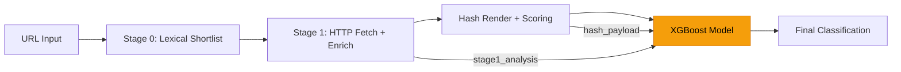

# XGBoost Supportive Model for Phishing Detection

## Overview

Build an XGBoost binary classifier that acts as a **supportive confidence booster** alongside the existing rule-based pipeline. The model consumes domain lexical features, WHOIS/RDAP registration data, TLS certificate signals, and perceptual hash similarity scores to catch patterns that deterministic rules miss.

---

## 1. Model Architecture & Integration Point



**Integration:** The XGBoost model runs **after** the hash scoring stage (comparison.py) as a secondary classifier. It receives the combined feature vector from stage1 + hashing and outputs a phishing probability score (0.0–1.0) that the pipeline uses as an additional signal alongside the existing rule-based scores.

---

## 2. Complete Feature List (65 Features)

### Category A: URL Lexical Features (15 features)

These are extracted purely from the URL string — no network calls needed.

| # | Feature Name | Type | Description | Why It Matters |
|---|---|---|---|---|
| 1 | `url_length` | int | Total character count of the URL | Phishing URLs tend to be longer (avg 75+ chars vs 40 for legit) |
| 2 | `domain_length` | int | Character count of the registered domain | Phishing domains are often longer to mimic legit brands |
| 3 | `subdomain_count` | int | Number of subdomains (dots in host minus TLD) | Multiple subdomains used for deception (e.g., `login.google.com.evil.com`) |
| 4 | `path_depth` | int | Number of `/` segments in path | Deep paths often hide phishing pages |
| 5 | `has_ip_address` | bool→int | URL contains an IP address instead of domain | Strong phishing signal |
| 6 | `has_at_symbol` | bool→int | URL contains `@` | Used to confuse browser URL parsing |
| 7 | `has_double_slash_redirect` | bool→int | URL contains `//` after protocol | Redirect obfuscation technique |
| 8 | `has_dash_in_domain` | bool→int | Domain contains `-` | `paypal-login.evil.com` pattern |
| 9 | `dot_count` | int | Total dots in URL | Excessive dots = subdomain abuse |
| 10 | `special_char_count` | int | Count of `@`, `!`, `#`, `$`, `%`, `^`, `&`, `*` | Obfuscation signals |
| 11 | `digit_ratio` | float | Ratio of digits to total URL length | Random-looking domains have high digit ratios |
| 12 | `has_suspicious_tld` | bool→int | TLD in suspicious set (`.xyz`, `.top`, `.buzz`, `.tk`, `.ml`, `.ga`, `.cf`) | Frequently abused free/cheap TLDs |
| 13 | `query_param_count` | int | Number of `?key=val` parameters | Phishing URLs embed tracking/encoded data |
| 14 | `has_encoded_chars` | bool→int | URL contains `%xx` encoded characters | Obfuscation technique |
| 15 | `entropy` | float | Shannon entropy of the domain string | High entropy = random/generated domain |

### Category B: Domain Structural Features (8 features)

| # | Feature Name | Type | Description | Why It Matters |
|---|---|---|---|---|
| 16 | `domain_token_count` | int | Words extracted from domain by splitting on `-`, `.` | `secure-login-paypal.com` = 3 tokens |
| 17 | `brand_in_subdomain` | bool→int | Known brand name appears in subdomain but not in registered domain | Classic squatting pattern |
| 18 | `brand_in_path` | bool→int | Known brand name appears in URL path | `/paypal/login.html` pattern |
| 19 | `typosquat_distance` | float | Min edit distance to any known entity domain (via your entity_db) | Measures closeness to legitimate brands |
| 20 | `typosquat_ratio` | float | `1.0 - (typosquat_distance / max(len(domain), len(entity_domain)))` | Normalized similarity to best-match entity |
| 21 | `punycode_present` | bool→int | Domain contains punycode (`xn--`) | Homoglyph/IDN attacks |
| 22 | `tld_abuse_score` | float | Historical abuse rate of the TLD (from public datasets) | `.tk`, `.ml` = high abuse |
| 23 | `domain_vowel_ratio` | float | Ratio of vowels to consonants in domain | Random domains have abnormal vowel ratios |

### Category C: WHOIS/RDAP Registration Features (12 features)

> [!IMPORTANT]
> These are the **highest-value features** for catching phishing. Your pipeline already extracts `rdap_creation_date` and `rdap_age_days` via `lookup_rdap()` in `stage1_http_analyzer.py`.

| # | Feature Name | Type | Source | Why It Matters |
|---|---|---|---|---|
| 24 | `domain_age_days` | int | `rdap_age_days` from enrichment | **#1 phishing indicator** — 70%+ of phishing domains are < 30 days old |
| 25 | `domain_age_bucket` | int | Categorical: 0=<7d, 1=<30d, 2=<90d, 3=<365d, 4=1yr+ | Enables non-linear age patterns |
| 26 | `registration_length_days` | int | `expiry_date - creation_date` | Short reg periods (≤1 year) = disposable domain |
| 27 | `days_to_expiry` | int | `expiry_date - now` | Domains expiring soon are likely phishing |
| 28 | `registrar_is_free` | bool→int | Registrar is in known free/abuse set (Freenom, NameSilo free, etc.) | Free registrars heavily abused |
| 29 | `registrar_encoded` | int | Target-encoded registrar name (by phishing rate) | Captures per-registrar risk patterns |
| 30 | `whois_privacy_enabled` | bool→int | WHOIS privacy/proxy service detected | 85%+ of phishing domains use privacy |
| 31 | `registrant_country_risk` | float | Risk score of registrant country (from historical data) | Certain countries have higher phishing rates |
| 32 | `nameserver_count` | int | Number of NS records | Phishing sites often have 1-2 NS records |
| 33 | `nameserver_is_default` | bool→int | NS belongs to registrar default (not custom) | Legitimate sites use custom DNS |
| 34 | `dnssec_enabled` | bool→int | DNSSEC is configured | Phishing domains rarely enable DNSSEC |
| 35 | `rdap_available` | bool→int | RDAP lookup succeeded (vs timeout/failure) | Unavailable RDAP can indicate suspicious infrastructure |

**How to extract (not yet in your pipeline):**

```python
# Add to rdap_utils.py or create whois_features.py
import whois  # python-whois library

def extract_whois_features(domain: str) -> dict:
    """Extract WHOIS features for XGBoost model."""
    try:
        w = whois.whois(domain)
        creation = w.creation_date
        expiry = w.expiration_date
        # Handle lists (some registrars return lists)
        if isinstance(creation, list): creation = creation[0]
        if isinstance(expiry, list): expiry = expiry[0]
        
        now = datetime.now()
        age_days = (now - creation).days if creation else -1
        reg_length = (expiry - creation).days if (creation and expiry) else -1
        days_to_expiry = (expiry - now).days if expiry else -1
        
        registrar = str(w.registrar or "").lower()
        free_registrars = {"freenom", "namesilo", "namecheap free"}
        
        return {
            "domain_age_days": age_days,
            "domain_age_bucket": (0 if age_days < 7 else 1 if age_days < 30 
                                  else 2 if age_days < 90 else 3 if age_days < 365 else 4),
            "registration_length_days": reg_length,
            "days_to_expiry": days_to_expiry,
            "registrar_is_free": int(any(r in registrar for r in free_registrars)),
            "registrar_name": registrar,  # for target encoding later
            "whois_privacy_enabled": int("privacy" in registrar or "proxy" in registrar 
                                         or "redacted" in str(w.org or "").lower()),
            "nameserver_count": len(w.name_servers or []),
            "dnssec_enabled": int(bool(w.dnssec and str(w.dnssec).lower() not in ("unsigned", ""))),
            "rdap_available": 1,
        }
    except Exception:
        return {k: -1 for k in ["domain_age_days", "domain_age_bucket", 
                "registration_length_days", "days_to_expiry", "registrar_is_free",
                "whois_privacy_enabled", "nameserver_count", "dnssec_enabled",
                "rdap_available"]}
```

### Category D: TLS/SSL Certificate Features (8 features)

> [!NOTE]  
> Your pipeline already extracts `cert_cn`, `cert_san`, `cert_issuer` in `enrich_stage1_result()`.

| # | Feature Name | Type | Source | Why It Matters |
|---|---|---|---|---|
| 36 | `ssl_present` | bool→int | TLS handshake succeeded | 95%+ of legitimate sites have SSL |
| 37 | `ssl_valid` | bool→int | Certificate is valid (not expired, not self-signed) | Self-signed = strong phishing signal |
| 38 | `ssl_days_to_expiry` | int | Days until cert expires | Short-lived certs common in phishing |
| 39 | `ssl_issuer_is_free` | bool→int | Issuer is Let's Encrypt, ZeroSSL, Buypass | Free certs heavily abused |
| 40 | `ssl_cn_matches_domain` | bool→int | `cert_cn == domain` | CN mismatch = suspicious |
| 41 | `ssl_san_count` | int | Number of Subject Alternative Names | Wildcard/many SANs = shared hosting |
| 42 | `ssl_org_present` | bool→int | Organization field in cert is non-empty | OV/EV certs have org, DV don't |
| 43 | `ssl_hash_distance` | float | Min Hamming distance of SSL simhash to entity DB | From your `compute_ssl_simhash()` |

### Category E: Hash-Based Visual Similarity Features (10 features)

> [!IMPORTANT]
> These leverage your existing `similarity_hashing.py` and `comparison.py` infrastructure.

| # | Feature Name | Type | Source | Why It Matters |
|---|---|---|---|---|
| 44 | `favicon_hash_distance` | int | Min phash distance to entity DB favicons | Close favicon = impersonation |
| 45 | `favicon_hash_match` | bool→int | `favicon_hash_distance <= 8` | Binary: is favicon similar to a known brand? |
| 46 | `page_phash_distance` | int | Min phash distance of page screenshot to entity DB | Visual clone detection |
| 47 | `page_phash_match` | bool→int | `page_phash_distance <= 10` | Binary: page looks like a known brand? |
| 48 | `domain_simhash_distance` | int | `compute_domain_simhash()` distance to best entity | Domain text similarity |
| 49 | `ssl_simhash_distance` | int | `compute_ssl_simhash()` distance to best entity | SSL cert similarity |
| 50 | `html_simhash_distance` | int | Simhash of page HTML content vs entity DB | Structural similarity |
| 51 | `hash_composite_score` | float | Weighted composite from your `DEFAULT_SCORING_WEIGHTS` | Your existing 100-pt score |
| 52 | `hash_entity_match_count` | int | Number of entities with score > threshold | Multiple entity matches = suspicious |
| 53 | `visual_vs_domain_mismatch` | bool→int | Page looks like entity A but domain is not entity A's | **Strongest phishing signal** |

### Category F: Content & Behavioral Features (8 features)

> [!NOTE]
> Already extracted in `_default_stage1_result()` and `score_stage1_http_signals()`.

| # | Feature Name | Type | Source | Why It Matters |
|---|---|---|---|---|
| 54 | `has_login_form` | bool→int | `page_has_login_form` | Credential harvesting indicator |
| 55 | `has_password_field` | bool→int | `page_has_password_field` | Direct credential theft |
| 56 | `form_action_mismatch` | bool→int | Form submits to different domain than page | Data exfiltration pattern |
| 57 | `input_count` | int | Number of `<input>` elements | > 3 inputs = likely a form collecting PII |
| 58 | `iframe_count` | int | Number of `<iframe>` elements | Used to embed phishing content |
| 59 | `redirect_count` | int | Number of HTTP redirects | Chain redirects used to hide final destination |
| 60 | `meta_refresh_present` | bool→int | `<meta http-equiv="refresh">` found | Auto-redirect evasion |
| 61 | `js_redirect_present` | bool→int | JavaScript-based redirect detected | Evasion technique |

### Category G: Network & Infrastructure Features (4 features)

| # | Feature Name | Type | Source | Why It Matters |
|---|---|---|---|---|
| 62 | `dns_answer_count` | int | Number of DNS A/AAAA records | Single record + new domain = suspicious |
| 63 | `asn_risk_score` | float | Risk score of ASN (from threat intelligence feeds) | Certain ASNs are hosting hotspots |
| 64 | `hosting_country_risk` | float | Risk score of hosting country | Geolocation-based risk |
| 65 | `ip_is_shared` | bool→int | IP resolves to many different domains | Shared hosting = higher phishing risk |

---

## 3. Training Data Strategy

### Labeled Data Sources

| Source | Type | Volume | URL |
|---|---|---|---|
| **PhishTank** | Verified phishing URLs | 50K+/month | phishtank.org |
| **OpenPhish** | Community phishing feed | 10K+/month | openphish.com |
| **URLhaus** | Malware distribution URLs | 200K+ | urlhaus.abuse.ch |
| **Tranco Top 1M** | Legitimate domains (benign) | 1M | tranco-list.eu |
| **Majestic Million** | Legitimate domains (benign) | 1M | majestic.com/reports/majestic-million |
| **Your Pipeline Output** | Labeled from manual review | Varies | `server_output/url_results.csv` |

### Dataset Construction

```python
# Recommended: 1:3 ratio (phishing:benign) with stratified sampling
# Target: 50,000 phishing + 150,000 benign = 200,000 total

DATASET_COMPOSITION = {
    "phishing": {
        "phishtank_verified": 30_000,      # High confidence
        "openphish_community": 10_000,      # Diverse
        "pipeline_confirmed": 10_000,       # From your own labeled data
    },
    "benign": {
        "tranco_top_100k": 50_000,          # High-traffic legit sites
        "tranco_100k_1m": 50_000,           # Long-tail legit sites  
        "pipeline_cleared": 50_000,         # From your pipeline (not phishing)
    }
}
```

### Feature Extraction Pipeline

```python
import pandas as pd
import asyncio
from phishing_pipeline.comparison import normalize_url
from phishing_pipeline.stage1_http_analyzer import (
    fetch_stage1_http_artifacts,
    enrich_stage1_result,
    score_stage1_http_signals,
)
from phishing_pipeline.similarity_hashing import (
    compute_domain_simhash,
    compute_image_phash,
    compute_ssl_simhash,
    best_similarity_against_set,
)

async def extract_features_for_url(url: str, client, entity_context, ordered_entities) -> dict:
    """Extract all 65 features for a single URL."""
    features = {}
    
    # --- Category A: URL Lexical ---
    features.update(extract_url_lexical_features(url))
    
    # --- Category B: Domain Structural ---
    features.update(extract_domain_structural_features(url, entity_context))
    
    # --- Category C: WHOIS/RDAP ---
    features.update(extract_whois_features(urlparse(url).netloc))
    
    # --- Categories D, E, F: Stage1 + Hash (from pipeline) ---
    stage1_result = await analyze_stage1_url(
        url, client,
        entity_context=entity_context,
        ordered_entities=ordered_entities,
    )
    features.update(extract_stage1_features(stage1_result))
    
    # Hash features require browser render (from comparison.py)
    # These come from hash_payload after render
    
    return features
```

---

## 4. Model Training Code

### dependencies

```
pip install xgboost>=2.0.0 optuna scikit-learn pandas numpy python-whois
```

### Full Training Script

```python
"""
xgboost_phishing_model.py
Supportive XGBoost model for phishing pattern detection.
"""
import json
import os
import numpy as np
import pandas as pd
import xgboost as xgb
from sklearn.model_selection import StratifiedKFold, cross_val_score
from sklearn.metrics import (
    classification_report, confusion_matrix, roc_auc_score,
    precision_recall_curve, f1_score, average_precision_score,
)
from sklearn.preprocessing import LabelEncoder
import optuna
import joblib
import logging

logger = logging.getLogger(__name__)

# ──────────────────────────────────────────────────────────────
# 1. FEATURE ENGINEERING
# ──────────────────────────────────────────────────────────────

NUMERICAL_FEATURES = [
    # Category A: URL Lexical
    "url_length", "domain_length", "subdomain_count", "path_depth",
    "dot_count", "special_char_count", "digit_ratio", "query_param_count",
    "entropy",
    # Category B: Domain Structural
    "domain_token_count", "typosquat_distance", "typosquat_ratio",
    "domain_vowel_ratio",
    # Category C: WHOIS/RDAP
    "domain_age_days", "domain_age_bucket", "registration_length_days",
    "days_to_expiry", "nameserver_count",
    # Category D: TLS/SSL
    "ssl_days_to_expiry", "ssl_san_count", "ssl_hash_distance",
    # Category E: Hash-Based
    "favicon_hash_distance", "page_phash_distance", "domain_simhash_distance",
    "ssl_simhash_distance", "html_simhash_distance", "hash_composite_score",
    "hash_entity_match_count",
    # Category F: Content
    "input_count", "iframe_count", "redirect_count",
    # Category G: Network
    "dns_answer_count", "asn_risk_score", "hosting_country_risk",
]

BINARY_FEATURES = [
    # Category A
    "has_ip_address", "has_at_symbol", "has_double_slash_redirect",
    "has_dash_in_domain", "has_suspicious_tld", "has_encoded_chars",
    # Category B
    "brand_in_subdomain", "brand_in_path", "punycode_present",
    # Category C
    "registrar_is_free", "whois_privacy_enabled", "dnssec_enabled",
    "rdap_available",
    # Category D
    "ssl_present", "ssl_valid", "ssl_issuer_is_free",
    "ssl_cn_matches_domain", "ssl_org_present",
    # Category E
    "favicon_hash_match", "page_phash_match", "visual_vs_domain_mismatch",
    # Category F
    "has_login_form", "has_password_field", "form_action_mismatch",
    "meta_refresh_present", "js_redirect_present",
    # Category G
    "ip_is_shared",
]

CATEGORICAL_FEATURES = [
    "registrar_encoded",       # Target-encoded registrar
    "tld_abuse_score",         # TLD risk score
    "registrant_country_risk", # Country risk
]

ALL_FEATURES = NUMERICAL_FEATURES + BINARY_FEATURES + CATEGORICAL_FEATURES
TARGET = "is_phishing"


def load_and_prepare_dataset(csv_path: str) -> tuple[pd.DataFrame, pd.Series]:
    """Load training CSV and separate features/target."""
    df = pd.read_csv(csv_path)
    
    # Handle missing values
    for col in NUMERICAL_FEATURES:
        if col in df.columns:
            df[col] = df[col].fillna(-1)
    for col in BINARY_FEATURES:
        if col in df.columns:
            df[col] = df[col].fillna(0).astype(int)
    
    available_features = [f for f in ALL_FEATURES if f in df.columns]
    X = df[available_features]
    y = df[TARGET].astype(int)
    
    logger.info("Dataset loaded: %d samples, %d features, %.1f%% phishing",
                len(df), len(available_features), y.mean() * 100)
    return X, y


# ──────────────────────────────────────────────────────────────
# 2. HYPERPARAMETER TUNING WITH OPTUNA
# ──────────────────────────────────────────────────────────────

def objective(trial, X, y):
    """Optuna objective for XGBoost hyperparameter tuning."""
    params = {
        "n_estimators": trial.suggest_int("n_estimators", 100, 1000, step=50),
        "max_depth": trial.suggest_int("max_depth", 3, 10),
        "learning_rate": trial.suggest_float("learning_rate", 0.01, 0.3, log=True),
        "subsample": trial.suggest_float("subsample", 0.6, 1.0),
        "colsample_bytree": trial.suggest_float("colsample_bytree", 0.5, 1.0),
        "min_child_weight": trial.suggest_int("min_child_weight", 1, 10),
        "gamma": trial.suggest_float("gamma", 0.0, 5.0),
        "reg_alpha": trial.suggest_float("reg_alpha", 1e-8, 10.0, log=True),
        "reg_lambda": trial.suggest_float("reg_lambda", 1e-8, 10.0, log=True),
        "scale_pos_weight": trial.suggest_float("scale_pos_weight", 1.0, 5.0),
        "objective": "binary:logistic",
        "eval_metric": "aucpr",  # Area Under Precision-Recall Curve
        "tree_method": "hist",   # GPU: use "gpu_hist"
        "random_state": 42,
    }
    
    model = xgb.XGBClassifier(**params)
    skf = StratifiedKFold(n_splits=5, shuffle=True, random_state=42)
    scores = cross_val_score(model, X, y, cv=skf, scoring="f1", n_jobs=-1)
    return scores.mean()


def tune_hyperparameters(X, y, n_trials=100):
    """Run Optuna hyperparameter search."""
    study = optuna.create_study(direction="maximize", study_name="xgb_phishing")
    study.optimize(lambda trial: objective(trial, X, y), n_trials=n_trials)
    
    logger.info("Best trial F1: %.4f", study.best_trial.value)
    logger.info("Best params: %s", json.dumps(study.best_trial.params, indent=2))
    return study.best_trial.params


# ──────────────────────────────────────────────────────────────
# 3. TRAINING & EVALUATION
# ──────────────────────────────────────────────────────────────

def train_and_evaluate(X, y, params=None):
    """Train final model with 5-fold cross-validation."""
    if params is None:
        # Sensible defaults if no tuning
        params = {
            "n_estimators": 500,
            "max_depth": 6,
            "learning_rate": 0.05,
            "subsample": 0.8,
            "colsample_bytree": 0.8,
            "min_child_weight": 3,
            "gamma": 0.1,
            "reg_alpha": 0.1,
            "reg_lambda": 1.0,
            "scale_pos_weight": 3.0,  # Adjust based on class ratio
            "objective": "binary:logistic",
            "eval_metric": "aucpr",
            "tree_method": "hist",
            "random_state": 42,
        }
    
    # Cross-validation evaluation
    skf = StratifiedKFold(n_splits=5, shuffle=True, random_state=42)
    fold_metrics = []
    
    for fold, (train_idx, val_idx) in enumerate(skf.split(X, y)):
        X_train, X_val = X.iloc[train_idx], X.iloc[val_idx]
        y_train, y_val = y.iloc[train_idx], y.iloc[val_idx]
        
        model = xgb.XGBClassifier(**params)
        model.fit(
            X_train, y_train,
            eval_set=[(X_val, y_val)],
            verbose=False,
        )
        
        y_pred = model.predict(X_val)
        y_prob = model.predict_proba(X_val)[:, 1]
        
        metrics = {
            "fold": fold,
            "f1": f1_score(y_val, y_pred),
            "auc_roc": roc_auc_score(y_val, y_prob),
            "auc_pr": average_precision_score(y_val, y_prob),
        }
        fold_metrics.append(metrics)
        logger.info("Fold %d: F1=%.4f, AUC-ROC=%.4f, AUC-PR=%.4f",
                    fold, metrics["f1"], metrics["auc_roc"], metrics["auc_pr"])
    
    # Train final model on ALL data
    final_model = xgb.XGBClassifier(**params)
    final_model.fit(X, y, verbose=False)
    
    # Feature importance
    importance = pd.DataFrame({
        "feature": X.columns,
        "importance": final_model.feature_importances_,
    }).sort_values("importance", ascending=False)
    
    return final_model, fold_metrics, importance


# ──────────────────────────────────────────────────────────────
# 4. SAVE & LOAD
# ──────────────────────────────────────────────────────────────

def save_model(model, importance, output_dir="models"):
    """Save trained model and metadata."""
    os.makedirs(output_dir, exist_ok=True)
    
    # Save XGBoost native format (best for production)
    model.save_model(os.path.join(output_dir, "xgb_phishing.json"))
    
    # Save sklearn-compatible format (for joblib loading)
    joblib.dump(model, os.path.join(output_dir, "xgb_phishing.joblib"))
    
    # Save feature importance
    importance.to_csv(os.path.join(output_dir, "feature_importance.csv"), index=False)
    
    # Save feature list for inference
    with open(os.path.join(output_dir, "feature_config.json"), "w") as f:
        json.dump({
            "features": list(importance["feature"]),
            "version": "1.0",
        }, f, indent=2)
    
    logger.info("Model saved to %s", output_dir)


def load_model(model_dir="models"):
    """Load trained model for inference."""
    model = xgb.XGBClassifier()
    model.load_model(os.path.join(model_dir, "xgb_phishing.json"))
    with open(os.path.join(model_dir, "feature_config.json")) as f:
        config = json.load(f)
    return model, config["features"]


# ──────────────────────────────────────────────────────────────
# 5. INFERENCE (for pipeline integration)
# ──────────────────────────────────────────────────────────────

def predict_phishing_probability(model, feature_dict: dict, feature_order: list) -> float:
    """Predict phishing probability for a single URL's features."""
    # Ensure features are in correct order with defaults
    row = [float(feature_dict.get(f, -1)) for f in feature_order]
    X = np.array([row])
    prob = model.predict_proba(X)[0, 1]
    return float(prob)


# ──────────────────────────────────────────────────────────────
# MAIN
# ──────────────────────────────────────────────────────────────

if __name__ == "__main__":
    logging.basicConfig(level=logging.INFO)
    
    # 1. Load data
    X, y = load_and_prepare_dataset("data/training_dataset.csv")
    
    # 2. Tune hyperparameters (optional, takes ~30 min)
    # best_params = tune_hyperparameters(X, y, n_trials=100)
    
    # 3. Train and evaluate
    model, metrics, importance = train_and_evaluate(X, y)
    
    # 4. Save
    save_model(model, importance)
    
    # 5. Print top features
    print("\n=== Top 20 Most Important Features ===")
    print(importance.head(20).to_string(index=False))
```

---

## 5. Integration Into Pipeline

### Where to add the XGBoost call

In `comparison.py`, after the hash scoring produces `hash_composite_score`, add:

```python
# In the scoring function, after hash scores are computed:
from .xgboost_phishing_model import load_model, predict_phishing_probability

_xgb_model, _xgb_features = load_model("models")

def get_xgb_confidence(stage1_result: dict, hash_payload: dict) -> float:
    """Get XGBoost phishing probability as a secondary signal."""
    features = {**extract_all_features(stage1_result, hash_payload)}
    return predict_phishing_probability(_xgb_model, features, _xgb_features)
```

### How to use the score

```python
# The XGBoost score acts as a BOOSTER, not a replacement:
xgb_prob = get_xgb_confidence(stage1_result, hash_payload)

if xgb_prob >= 0.85:
    # High confidence from ML — escalate even if rule-based score is borderline
    escalate_reason += "|xgb_high_confidence"
elif xgb_prob >= 0.60 and rule_based_score >= low_band_min:
    # Medium confidence + some rule signals — escalate
    escalate_reason += "|xgb_medium_confidence"
# XGBoost never overrides a phishing classification — only boosts borderline cases
```

---

## 6. Training Data Collection Workflow

### Step 1: Collect labeled URLs

```bash
# Download PhishTank verified data
curl -o phishtank_data.json "http://data.phishtank.com/data/online-valid.json"

# Download Tranco top-1M for benign
curl -o tranco_top1m.csv "https://tranco-list.eu/top-1m.csv.zip"
```

### Step 2: Extract features (batch processing)

```bash
python extract_training_features.py \
    --phishing-urls phishtank_data.json \
    --benign-urls tranco_top1m.csv \
    --output data/training_dataset.csv \
    --max-phishing 50000 \
    --max-benign 150000 \
    --workers 48
```

### Step 3: Train

```bash
python xgboost_phishing_model.py
```

### Step 4: Validate on held-out pipeline data

```bash
python validate_xgb_on_pipeline.py \
    --model models/xgb_phishing.json \
    --test-data server_output/url_results.csv
```

---

## 7. Expected Performance

Based on literature and similar implementations:

| Metric | Expected Range |
|---|---|
| **F1 Score** | 0.94 – 0.97 |
| **AUC-ROC** | 0.98 – 0.99 |
| **Precision** | 0.95 – 0.98 |
| **Recall** | 0.92 – 0.96 |
| **Inference Time** | < 1ms per URL |

### Top Features by Importance (expected)

1. `domain_age_days` — strongest single predictor
2. `visual_vs_domain_mismatch` — visual clone + wrong domain
3. `favicon_hash_distance` — brand impersonation
4. `has_login_form` + `brand_in_subdomain` combo
5. `ssl_issuer_is_free` + `domain_age_days < 30` combo

> [!TIP]
> XGBoost excels at learning **feature interactions** — that's why it catches patterns that individual rule thresholds miss. For example: `domain_age < 7 AND has_password_field AND brand_in_path AND ssl_issuer_is_free` is almost certainly phishing, but each feature alone is not conclusive.
