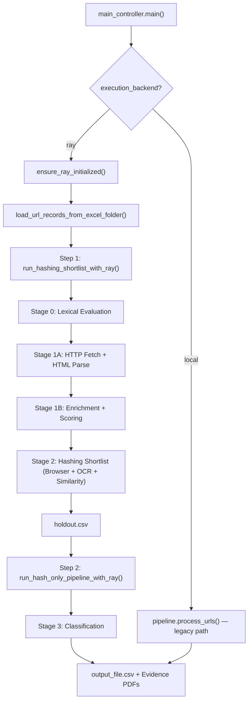
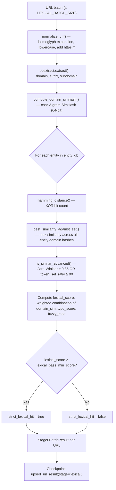
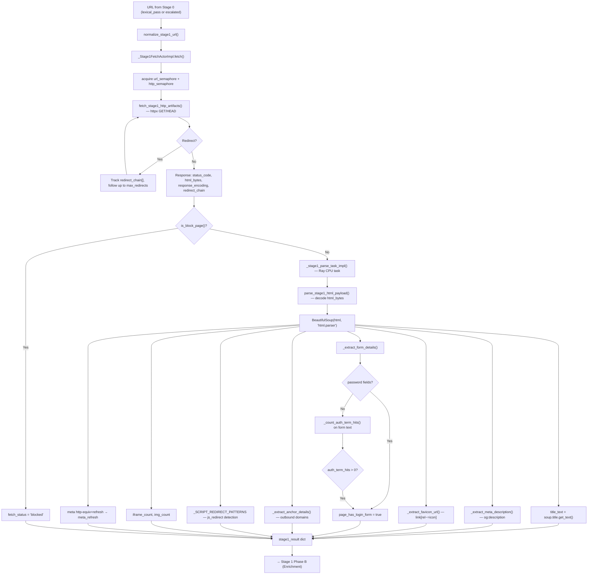
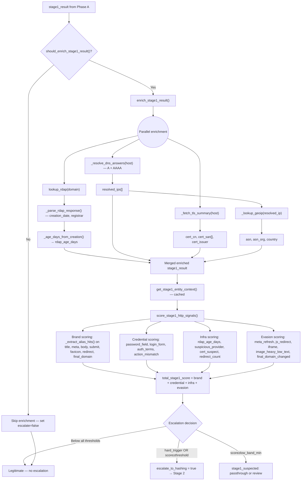
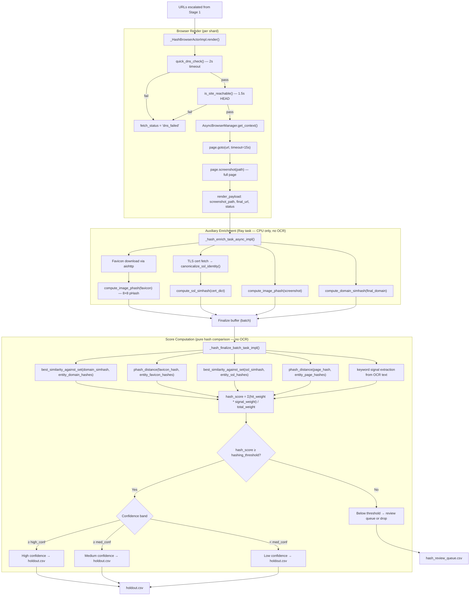
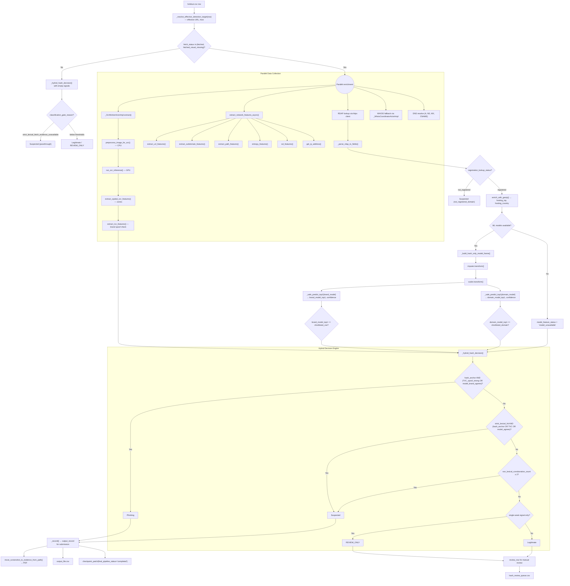
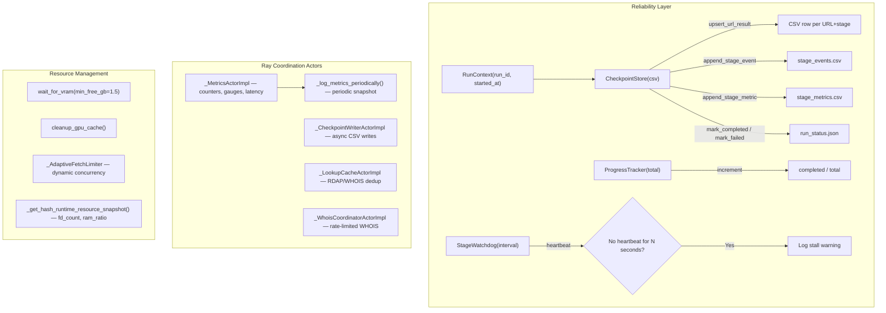

# Phishing Detection Pipeline — Stage-by-Stage Architecture & Flowcharts

> **Codebase**: `c:\Users\SATWIK\Documents\Phishing\phishing_pipeline`
> **Runtime**: Ray (distributed actors + tasks), asyncio (local orchestration)
> **Every method below is directly referenced in the current codebase. No detached or orphaned methods.**

---

## Table of Contents

1. [Overall Pipeline Orchestration](#1-overall-pipeline-orchestration)
2. [Stage 0 — Lexical Evaluation (Batch)](#2-stage-0--lexical-evaluation-batch)
3. [Stage 1 Phase A — HTTP Fetch & HTML Parse](#3-stage-1-phase-a--http-fetch--html-parse)
4. [Stage 1 Phase B — Enrichment (RDAP / DNS / TLS / GeoIP / Scoring)](#4-stage-1-phase-b--enrichment-rdap--dns--tls--geoip--scoring)
5. [Stage 2 — Hashing Shortlist (Browser Render → OCR → Similarity Scoring)](#5-stage-2--hashing-shortlist-browser-render--ocr--similarity-scoring)
6. [Stage 3 — Classification (Models + TVC + Hybrid Decision)](#6-stage-3--classification-models--tvc--hybrid-decision)
7. [Cross-Cutting: Reliability & Checkpointing](#7-cross-cutting-reliability--checkpointing)
8. [File → Stage Mapping](#8-file--stage-mapping)

---

## 1. Overall Pipeline Orchestration

### Entry Point

| Layer | File | Function |
|-------|------|----------|
| CLI | [main_controller.py](file:///c:/Users/SATWIK/Documents/Phishing/main_controller.py) | `main()` |
| Shortlist Orchestrator | [ray_runtime.py](file:///c:/Users/SATWIK/Documents/Phishing/phishing_pipeline/ray_runtime.py) | `run_hashing_shortlist_with_ray()` |
| Shortlist Impl | [ray_shortlist_runtime.py](file:///c:/Users/SATWIK/Documents/Phishing/phishing_pipeline/ray_shortlist_runtime.py) | `run_hashing_shortlist_with_ray_impl()` |
| Classify Orchestrator | [ray_runtime.py](file:///c:/Users/SATWIK/Documents/Phishing/phishing_pipeline/ray_runtime.py) | `run_hash_only_pipeline_with_ray()` |
| Classify Impl | [ray_classify_runtime.py](file:///c:/Users/SATWIK/Documents/Phishing/phishing_pipeline/ray_classify_runtime.py) | `run_hash_only_pipeline_with_ray_impl()` |
| Legacy Pipeline | [pipeline.py](file:///c:/Users/SATWIK/Documents/Phishing/phishing_pipeline/pipeline.py) | `process_urls()` |

### Inputs & Outputs

| Item | Description |
|------|-------------|
| **Input** | Excel folder of suspected URLs (`load_url_records_from_excel_folder()` in [shortlisting.py](file:///c:/Users/SATWIK/Documents/Phishing/phishing_pipeline/shortlisting.py)) |
| **Input** | Entity hash DB (`data/entity_hash_db.json`) loaded by `_load_entity_db()` in [comparison.py](file:///c:/Users/SATWIK/Documents/Phishing/phishing_pipeline/comparison.py#L675) |
| **Input** | TVC Brand Catalog loaded by `_get_tvc_brand_catalog()` in [utils.py](file:///c:/Users/SATWIK/Documents/Phishing/phishing_pipeline/utils.py#L671) |
| **Input** | Whitelist Excel (`Stage_2_Legitimate_Domains_80.xlsx`) |
| **Output** | `holdout.csv` (shortlisted matches after hashing) |
| **Output** | `output_file.csv` / `output_file_filtered.csv` (final classified results) |
| **Output** | Evidence PDFs per flagged domain |
| **Output** | Debug CSVs: `stage1_lexical_debug.csv`, `stage1_methods_debug.csv`, `stage2_model_debug.csv`, `stage3_classification_debug.csv` |

---

## 2. Stage 0 — Lexical Evaluation (Batch)

### Purpose
Fast, CPU-only pre-filter that evaluates every URL against the entity database using string similarity, typosquatting detection, and domain simhash comparison. Determines which URLs warrant deeper analysis.

### Key Files & Methods

| File | Method | Role |
|------|--------|------|
| [ray_runtime.py](file:///c:/Users/SATWIK/Documents/Phishing/phishing_pipeline/ray_runtime.py#L798) | `_stage0_batch_task_impl()` | Ray task entry — batch lexical eval |
| [comparison.py](file:///c:/Users/SATWIK/Documents/Phishing/phishing_pipeline/comparison.py#L801) | `_compute_prefetch_lexical_state_batch()` | Core batch lexical evaluation |
| [comparison.py](file:///c:/Users/SATWIK/Documents/Phishing/phishing_pipeline/comparison.py) | `normalize_url()` | URL normalization with homoglyph expansion |
| [shortlisting.py](file:///c:/Users/SATWIK/Documents/Phishing/phishing_pipeline/shortlisting.py#L51) | `normalize_url()` | Legacy URL normalization (homoglyph map) |
| [shortlisting.py](file:///c:/Users/SATWIK/Documents/Phishing/phishing_pipeline/shortlisting.py#L74) | `get_primary_part()` | Extract primary domain via tldextract |
| [shortlisting.py](file:///c:/Users/SATWIK/Documents/Phishing/phishing_pipeline/shortlisting.py#L80) | `is_similar_advanced()` | Jaro-Winkler + fuzzy token set match |
| [similarity_hashing.py](file:///c:/Users/SATWIK/Documents/Phishing/phishing_pipeline/similarity_hashing.py#L126) | `compute_domain_simhash()` | Domain char-3-gram SimHash |
| [similarity_hashing.py](file:///c:/Users/SATWIK/Documents/Phishing/phishing_pipeline/similarity_hashing.py#L48) | `best_similarity_against_set()` | Best hamming distance against entity hash set |
| [similarity_hashing.py](file:///c:/Users/SATWIK/Documents/Phishing/phishing_pipeline/similarity_hashing.py#L28) | `hamming_distance()` | Bitwise XOR hamming distance |

### Inputs / Outputs

| Direction | Data |
|-----------|------|
| **Input** | `normalized_urls: list[str]` — batch of URLs |
| **Input** | `lexical_eval_config: dict` — thresholds (typo_top_k, typo_min_score, lexical_pass_min_score, domain_similarity_threshold) |
| **Input** | `entity_db` — loaded entity hash DB with domain hashes, favicon hashes, SSL hashes |
| **Output** | `Stage0BatchResult` — per-URL: `lexical_score`, `best_entity`, `typo_anchor`, `strict_lexical_hit`, `lexical_score_pass`, `domain_simhash_similarity` |

### Concurrency
- Ray task with `num_cpus=1.0`
- `LEXICAL_WORKERS` parallel tasks (default: `min(32, max(4, CPU_COUNT-4))`)
- `LEXICAL_BATCH_SIZE` URLs per task (default: 1024)
- `LEXICAL_INFLIGHT_BATCHES` bounded inflight (default: `LEXICAL_WORKERS * 2`)

---

## 3. Stage 1 Phase A — HTTP Fetch & HTML Parse

### Purpose
For each URL that passes lexical evaluation, perform an HTTP fetch to capture the live page content. Parse the HTML to extract structural signals: title, forms, redirects, meta tags, favicon URL, and text content.

### Key Files & Methods

| File | Method | Role |
|------|--------|------|
| [ray_runtime.py](file:///c:/Users/SATWIK/Documents/Phishing/phishing_pipeline/ray_runtime.py#L949) | `_Stage1FetchActorImpl` | Ray actor — HTTP fetch worker |
| [ray_runtime.py](file:///c:/Users/SATWIK/Documents/Phishing/phishing_pipeline/ray_runtime.py#L955) | `_stage1_parse_task_impl()` | Ray task — HTML parse + feature extraction |
| [stage1_http_analyzer.py](file:///c:/Users/SATWIK/Documents/Phishing/phishing_pipeline/stage1_http_analyzer.py#L98) | `normalize_stage1_url()` | URL normalization for Stage 1 |
| [stage1_http_analyzer.py](file:///c:/Users/SATWIK/Documents/Phishing/phishing_pipeline/stage1_http_analyzer.py) | `fetch_stage1_http_artifacts()` | HTTP GET/HEAD with redirect tracking |
| [stage1_http_analyzer.py](file:///c:/Users/SATWIK/Documents/Phishing/phishing_pipeline/stage1_http_analyzer.py) | `parse_stage1_html_payload()` | HTML → features (BS4) |
| [stage1_http_analyzer.py](file:///c:/Users/SATWIK/Documents/Phishing/phishing_pipeline/stage1_http_analyzer.py#L300) | `_extract_stage1_html_features()` | Title, meta, forms, anchors, iframes |
| [stage1_http_analyzer.py](file:///c:/Users/SATWIK/Documents/Phishing/phishing_pipeline/stage1_http_analyzer.py#L221) | `_extract_form_details()` | Login form detection, password fields, action URLs |
| [stage1_http_analyzer.py](file:///c:/Users/SATWIK/Documents/Phishing/phishing_pipeline/stage1_http_analyzer.py#L281) | `_extract_anchor_details()` | Outbound domain analysis |
| [stage1_http_analyzer.py](file:///c:/Users/SATWIK/Documents/Phishing/phishing_pipeline/stage1_http_analyzer.py#L210) | `_extract_favicon_url()` | Favicon link extraction from HTML |
| [stage1_http_analyzer.py](file:///c:/Users/SATWIK/Documents/Phishing/phishing_pipeline/stage1_http_analyzer.py#L198) | `_extract_meta_description()` | og:description, twitter:description |
| [stage1_http_analyzer.py](file:///c:/Users/SATWIK/Documents/Phishing/phishing_pipeline/stage1_http_analyzer.py#L163) | `_count_auth_term_hits()` | Auth keyword detection (login, verify, password) |
| [stage1_http_analyzer.py](file:///c:/Users/SATWIK/Documents/Phishing/phishing_pipeline/stage1_http_analyzer.py#L70) | `build_stage1_concurrency_controls()` | Semaphore factory for HTTP/DNS/RDAP/TLS |
| [stage1_http_analyzer.py](file:///c:/Users/SATWIK/Documents/Phishing/phishing_pipeline/stage1_http_analyzer.py) | `_default_stage1_result()` | Default empty result structure |
| [comparison.py](file:///c:/Users/SATWIK/Documents/Phishing/phishing_pipeline/comparison.py#L611) | `clean_domain()` | Domain extraction from URL |
| [comparison.py](file:///c:/Users/SATWIK/Documents/Phishing/phishing_pipeline/comparison.py#L624) | `is_block_page()` | Detect error/block pages (403, 404, nginx) |

### Inputs / Outputs

| Direction | Data |
|-----------|------|
| **Input** | `normalized_url`, `lexical_prefetch_result` from Stage 0 |
| **Input** | `stage1_http_config` — timeout, concurrency, max_html_bytes, max_redirects |
| **Output** | `stage1_result` dict: `final_landing_url`, `redirect_chain`, `redirect_count`, `status_code`, `html_bytes`, `response_encoding`, `title_text`, `meta_description`, `visible_text`, `favicon_url`, `form_count`, `password_count`, `page_has_login_form`, `action_urls`, `iframe_count`, `meta_refresh`, `js_redirect` |

### Concurrency
- `_Stage1FetchActorImpl` actors: `stage1_fetch_actors` from `resolve_ray_runtime_config()`
- `Stage1ConcurrencyControls`: separate semaphores for URL, HTTP, DNS, RDAP, TLS
- `_AdaptiveFetchLimiter` — dynamic fetch concurrency based on timeout/failure ratios

---

## 4. Stage 1 Phase B — Enrichment (RDAP / DNS / TLS / GeoIP / Scoring)

### Purpose
Enrich the fetched result with infrastructure signals: domain age (RDAP), DNS resolution, TLS certificate details, and GeoIP data. Then score all signals against the entity database to produce a `stage1_total_score` and escalation decision.

### Key Files & Methods

| File | Method | Role |
|------|--------|------|
| [ray_runtime.py](file:///c:/Users/SATWIK/Documents/Phishing/phishing_pipeline/ray_runtime.py#L950) | `_Stage1EnrichActorImpl` | Ray actor — enrichment worker |
| [stage1_http_analyzer.py](file:///c:/Users/SATWIK/Documents/Phishing/phishing_pipeline/stage1_http_analyzer.py) | `enrich_stage1_result()` | Orchestrate RDAP + DNS + TLS enrichment |
| [stage1_http_analyzer.py](file:///c:/Users/SATWIK/Documents/Phishing/phishing_pipeline/stage1_http_analyzer.py) | `should_enrich_stage1_result()` | Gate: only enrich if brand/credential signals present |
| [stage1_http_analyzer.py](file:///c:/Users/SATWIK/Documents/Phishing/phishing_pipeline/stage1_http_analyzer.py#L532) | `score_stage1_http_signals()` | Multi-dimensional scoring engine |
| [stage1_http_analyzer.py](file:///c:/Users/SATWIK/Documents/Phishing/phishing_pipeline/stage1_http_analyzer.py#L404) | `get_stage1_entity_context()` | Cached entity context builder |
| [stage1_http_analyzer.py](file:///c:/Users/SATWIK/Documents/Phishing/phishing_pipeline/stage1_http_analyzer.py#L144) | `_extract_alias_hits()` | Brand alias matching on text surfaces |
| [stage1_http_analyzer.py](file:///c:/Users/SATWIK/Documents/Phishing/phishing_pipeline/stage1_http_analyzer.py#L484) | `_resolve_dns_answers()` | Async DNS A + AAAA resolution |
| [stage1_http_analyzer.py](file:///c:/Users/SATWIK/Documents/Phishing/phishing_pipeline/stage1_http_analyzer.py#L479) | `_fetch_tls_summary()` | TLS cert CN, SAN, Issuer extraction |
| [stage1_http_analyzer.py](file:///c:/Users/SATWIK/Documents/Phishing/phishing_pipeline/stage1_http_analyzer.py#L420) | `_lookup_geoip()` | ASN + country from IP via GeoIP2 |
| [stage1_http_analyzer.py](file:///c:/Users/SATWIK/Documents/Phishing/phishing_pipeline/stage1_http_analyzer.py#L191) | `_age_days_from_creation()` | Domain age in days from RDAP creation date |
| [rdap_utils.py](file:///c:/Users/SATWIK/Documents/Phishing/phishing_pipeline/rdap_utils.py#L181) | `lookup_rdap()` | RDAP lookup with caching, dedup, cooldown |
| [rdap_utils.py](file:///c:/Users/SATWIK/Documents/Phishing/phishing_pipeline/rdap_utils.py#L256) | `_parse_rdap_response()` | Parse RDAP JSON → creation_date, registrar, registrant |
| [utils.py](file:///c:/Users/SATWIK/Documents/Phishing/phishing_pipeline/utils.py#L609) | `_normalize_tvc_text()` | Text normalization for alias matching |
| [utils.py](file:///c:/Users/SATWIK/Documents/Phishing/phishing_pipeline/utils.py#L671) | `_get_tvc_brand_catalog()` | Runtime brand catalog (overrides + whitelist + entity_db) |

### Inputs / Outputs

| Direction | Data |
|-----------|------|
| **Input** | `stage1_result` from Phase A (HTML features, final_landing_url) |
| **Input** | `entity_context`, `ordered_entities` from `get_stage1_entity_context()` |
| **Input** | `stage1_http_config` — score weights, thresholds |
| **Output** | Enriched `stage1_result`: `rdap_age_days`, `cert_cn`, `cert_issuer`, `cert_san`, `resolved_ips`, `asn_org`, `country` |
| **Output** | Scores: `brand_score`, `credential_score`, `infra_score`, `evasion_score`, `total_stage1_score` |
| **Output** | Decision: `escalate_to_hashing` (bool), `escalate_reasons[]`, `hard_trigger_hit` |

### Scoring Dimensions (from `score_stage1_http_signals()`)

| Dimension | Signals | Weight Source |
|-----------|---------|---------------|
| **Brand** | title_brand_match, meta_brand_match, body_brand_match, submit_brand_match, favicon_brand_match, redirect_brand_match, final_domain_brand_match | `STAGE1_SCORE_WEIGHTS["brand"]` |
| **Credential** | password_field, login_form, auth_wording, submit_auth_wording, form_action_mismatch, multi_input_form | `STAGE1_SCORE_WEIGHTS["credential"]` |
| **Infrastructure** | very_new_domain (≤30d), new_domain (≤90d), suspicious_hosting_provider, suspicious_certificate, multi_redirect_chain | `STAGE1_SCORE_WEIGHTS["infra"]` |
| **Evasion** | meta_refresh, js_redirect, iframe_present, image_heavy_low_text, final_domain_changed | `STAGE1_SCORE_WEIGHTS["evasion"]` |

### Escalation Logic

| Condition | Reason |
|-----------|--------|
| `hard_trigger_hit` (brand + password/login_form) | `hard_trigger_hit` |
| `total_stage1_score ≥ escalate_total_threshold` | `stage1_score_threshold` |
| `brand_score ≥ brand_min AND credential_score ≥ credential_min` | `brand_credential_combo` |
| `total_stage1_score ≥ low_band_min` (non-escalated but suspected) | `stage1_suspected_non_escalated` |

---

## 5. Stage 2 — Hashing Shortlist (Browser Render → Similarity Scoring)

> [!IMPORTANT]
> **No OCR in Stage 2.** This stage is purely hash-based. OCR is only used later in Stage 3 (Classification) for TVC brand spoof detection.

### Purpose
For URLs escalated from Stage 1, perform deep visual and content analysis: render the page in a headless browser, capture screenshots, extract perceptual hashes (favicon, page, SSL, domain), and compute weighted similarity scores against the entity hash database. Produce the final `holdout.csv` shortlist.

### Key Files & Methods

| File | Method | Role |
|------|--------|------|
| [ray_shortlist_runtime.py](file:///c:/Users/SATWIK/Documents/Phishing/phishing_pipeline/ray_shortlist_runtime.py) | `run_hashing_shortlist_with_ray_impl()` | Top-level orchestrator for Stage 2 |
| [ray_runtime.py](file:///c:/Users/SATWIK/Documents/Phishing/phishing_pipeline/ray_runtime.py#L951) | `_HashBrowserActorImpl` | Ray actor — Playwright browser shard |
| [ray_runtime.py](file:///c:/Users/SATWIK/Documents/Phishing/phishing_pipeline/ray_runtime.py#L849) | `_hash_enrich_task_async_impl()` | Aux network fetches (favicon, SSL cert) |
| [ray_runtime.py](file:///c:/Users/SATWIK/Documents/Phishing/phishing_pipeline/ray_runtime.py#L879) | `_hash_finalize_batch_task_impl()` | Final score computation + threshold |
| [comparison.py](file:///c:/Users/SATWIK/Documents/Phishing/phishing_pipeline/comparison.py) | `_enrich_render_payload_for_hashing()` | Favicon download, SSL fetch, hash computation |
| [comparison.py](file:///c:/Users/SATWIK/Documents/Phishing/phishing_pipeline/comparison.py) | `_finalize_scored_hash_payload()` | Weighted score computation + threshold check |
| [comparison.py](file:///c:/Users/SATWIK/Documents/Phishing/phishing_pipeline/comparison.py#L365) | `_AdaptiveFetchLimiter` | Dynamic concurrency control |
| [comparison.py](file:///c:/Users/SATWIK/Documents/Phishing/phishing_pipeline/comparison.py#L458) | `_compute_hash_fetch_adjustment()` | Upshift/downshift logic for adaptive limiter |
| [visual_features.py](file:///c:/Users/SATWIK/Documents/Phishing/phishing_pipeline/visual_features.py#L327) | `capture_screenshot_async()` | Async Playwright screenshot with DNS/HEAD preflight |
| [visual_features.py](file:///c:/Users/SATWIK/Documents/Phishing/phishing_pipeline/visual_features.py#L232) | `quick_dns_check()` | 2s DNS preflight |
| [visual_features.py](file:///c:/Users/SATWIK/Documents/Phishing/phishing_pipeline/visual_features.py#L257) | `is_site_reachable()` | 1.5s HEAD preflight |
| [visual_features.py](file:///c:/Users/SATWIK/Documents/Phishing/phishing_pipeline/visual_features.py#L145) | `AsyncBrowserManager` | Singleton Playwright lifecycle manager |
| [similarity_hashing.py](file:///c:/Users/SATWIK/Documents/Phishing/phishing_pipeline/similarity_hashing.py#L66) | `compute_image_phash()` | PIL → imagehash.phash (perceptual hash) |
| [similarity_hashing.py](file:///c:/Users/SATWIK/Documents/Phishing/phishing_pipeline/similarity_hashing.py#L170) | `compute_ssl_simhash()` | SSL cert identity → SimHash |
| [similarity_hashing.py](file:///c:/Users/SATWIK/Documents/Phishing/phishing_pipeline/similarity_hashing.py#L145) | `canonicalize_ssl_identity()` | Normalize cert subject/issuer/SAN → canonical string |
| [comparison.py](file:///c:/Users/SATWIK/Documents/Phishing/phishing_pipeline/comparison.py#L650) | `phash_distance()` | Hamming distance between hex pHash strings |
| [comparison.py](file:///c:/Users/SATWIK/Documents/Phishing/phishing_pipeline/comparison.py#L650) | `phash_distance()` | Hamming distance between hex pHash strings |

### Inputs / Outputs

| Direction | Data |
|-----------|------|
| **Input** | URLs escalated from Stage 1 (`escalate_to_hashing=true`) |
| **Input** | `entity_db` — reference hashes (favicon_phash, page_phash, ssl_simhash, domain_simhash) per entity |
| **Input** | Scoring weights: `{domain, favicon, ssl_hash, html_hash, domain_hash, keywords}` |
| **Input** | Thresholds: `hashing_threshold`, `high_confidence_threshold`, `medium_confidence_threshold` |
| **Output** | `holdout.csv` — per-URL: `hash_score`, `matched_entity`, `confidence_band`, `signal_hit_*`, `evidence_tier`, `screenshot_path` (no OCR text at this stage) |

### Concurrency Controls

| Control | Source | Default |
|---------|--------|---------|
| Browser shards | `BROWSER_SHARDS` | `ceil(MAX_CONCURRENT_PAGES / SCRAPER_PAGE_CONCURRENCY)` |
| Pages per shard | `SCRAPER_PAGE_CONCURRENCY` | 4 |
| Total pages | `MAX_CONCURRENT_PAGES` | 24 |
| Render queue | `HASH_RENDER_QUEUE_MAX` | `render_workers * 128` |
| Result queue | `HASH_RESULT_QUEUE_MAX` | `render_workers * 4` |
| Aux HTTP | `HASH_AUX_HTTP_LIMIT` | 96 |
| Aux SSL | `HASH_AUX_SSL_LIMIT` | 64 |
| Per-host | `HASH_PER_HOST_LIMIT` | 4 |

### Hash Scoring Weights (from `DEFAULT_SCORING_WEIGHTS`)

| Signal | Weight |
|--------|--------|
| `domain` (domain SimHash) | 30.0 |
| `favicon` (favicon pHash) | 14.0 |
| `ssl_hash` (SSL SimHash) | 12.0 |
| `html_hash` (page pHash) | 6.0 |
| `domain_hash` (domain SimHash v2) | 8.0 |
| `keywords` (content keywords) | 10.0 |

---

## 6. Stage 3 — Classification (Models + TVC + Hybrid Decision)

### Purpose
For each shortlisted URL from `holdout.csv`, perform the final classification by combining: ML model inference (brand classification model, domain source model), Textual-Visual Consistency (TVC) analysis, OCR-based brand spoof detection, WHOIS/RDAP registration data, DNS records, and a hybrid decision engine. Produce the final output with evidence.

### Key Files & Methods

| File | Method | Role |
|------|--------|------|
| [ray_classify_runtime.py](file:///c:/Users/SATWIK/Documents/Phishing/phishing_pipeline/ray_classify_runtime.py) | `run_hash_only_pipeline_with_ray_impl()` | Orchestrate classification over holdout.csv |
| [ray_classify_runtime.py](file:///c:/Users/SATWIK/Documents/Phishing/phishing_pipeline/ray_classify_runtime.py#L114) | `classify_hash_only_row_impl()` | Per-row classification logic |
| [ray_runtime.py](file:///c:/Users/SATWIK/Documents/Phishing/phishing_pipeline/ray_runtime.py#L953) | `_HashOnlyClassifierActorImpl` | Ray actor — classifier worker |
| [ray_runtime.py](file:///c:/Users/SATWIK/Documents/Phishing/phishing_pipeline/ray_runtime.py#L952) | `_OcrWorkerActorImpl` | Ray actor — OCR + TVC extraction (**OCR is ONLY used here in Stage 3**) |
| [ray_runtime.py](file:///c:/Users/SATWIK/Documents/Phishing/phishing_pipeline/ray_runtime.py#L948) | `_WhoisCoordinatorActorImpl` | Rate-limited WHOIS actor |
| [pipeline.py](file:///c:/Users/SATWIK/Documents/Phishing/phishing_pipeline/pipeline.py) | `_hybrid_hash_decision()` | Core hybrid decision engine |
| [pipeline.py](file:///c:/Users/SATWIK/Documents/Phishing/phishing_pipeline/pipeline.py) | `_resolve_effective_detection_target()` | Resolve effective URL/domain for analysis |
| [pipeline.py](file:///c:/Users/SATWIK/Documents/Phishing/phishing_pipeline/pipeline.py#L1121) | `_extract_hash_only_ocr_tvc()` | **OCR + TVC extraction** — the ONLY place OCR runs in hash_only mode |
| [pipeline.py](file:///c:/Users/SATWIK/Documents/Phishing/phishing_pipeline/pipeline.py) | `_build_hash_only_model_frame()` | Build feature DataFrame for sklearn models |
| [pipeline.py](file:///c:/Users/SATWIK/Documents/Phishing/phishing_pipeline/pipeline.py) | `_safe_predict_top1()` | Safe model prediction wrapper |
| [pipeline.py](file:///c:/Users/SATWIK/Documents/Phishing/phishing_pipeline/pipeline.py) | `adjust_source()` | Map CSE/domain → source_of_detection |
| [pipeline.py](file:///c:/Users/SATWIK/Documents/Phishing/phishing_pipeline/pipeline.py) | `_parse_rdap_to_fields()` | Parse RDAP JSON → standard fields |
| [pipeline.py](file:///c:/Users/SATWIK/Documents/Phishing/phishing_pipeline/pipeline.py#L79) | `move_screenshot_to_evidence_from_path()` | Screenshot → evidence PDF |
| [model_utils.py](file:///c:/Users/SATWIK/Documents/Phishing/phishing_pipeline/model_utils.py) | `load_models_and_preproc()` | Load brand_model, domain_model, scaler, imputer |
| [utils.py](file:///c:/Users/SATWIK/Documents/Phishing/phishing_pipeline/utils.py#L774) | `extract_tvc_features()` | TVC brand spoof detection |
| [utils.py](file:///c:/Users/SATWIK/Documents/Phishing/phishing_pipeline/utils.py#L745) | `_resolve_tvc_brand()` | Resolve CSE/domain → brand catalog entry |
| [utils.py](file:///c:/Users/SATWIK/Documents/Phishing/phishing_pipeline/utils.py#L314) | `extract_network_features_async()` | Network features for model input |
| [features.py](file:///c:/Users/SATWIK/Documents/Phishing/phishing_pipeline/features.py#L76) | `extract_url_features()` | URL structural features |
| [features.py](file:///c:/Users/SATWIK/Documents/Phishing/phishing_pipeline/features.py#L137) | `extract_subdomain_features()` | Subdomain metrics |
| [features.py](file:///c:/Users/SATWIK/Documents/Phishing/phishing_pipeline/features.py#L173) | `extract_path_features()` | Path/query/fragment features |
| [features.py](file:///c:/Users/SATWIK/Documents/Phishing/phishing_pipeline/features.py#L223) | `entropy_features()` | Shannon entropy of URL and domain |
| [features.py](file:///c:/Users/SATWIK/Documents/Phishing/phishing_pipeline/features.py#L311) | `ssl_features()` | SSL certificate features |
| [features.py](file:///c:/Users/SATWIK/Documents/Phishing/phishing_pipeline/features.py#L250) | `get_ip_address()` | DNS hostname → IP resolution |
| [geoip_utils.py](file:///c:/Users/SATWIK/Documents/Phishing/phishing_pipeline/geoip_utils.py) | `enrich_with_geoip()` | IP → ASN, ISP, country |

### Inputs / Outputs

| Direction | Data |
|-----------|------|
| **Input** | `holdout.csv` rows — each with: URL, matched entity, hash_score, confidence_band, signal hits, screenshot_path, ocr_text, stage1 features |
| **Input** | Loaded ML models: `brand_model`, `domain_model`, `scaler`, `imputer`, `brand_classes`, `source_classes`, `feature_cols` |
| **Input** | `failed_fetch_suspected_min`, `failed_fetch_review_min` — rescue thresholds |
| **Output** | `ClassificationRecord`: output_record (submission), review_row, stage2_debug_row, stage3_debug_row, checkpoint_patch, stage_event |
| **Output** | Final `output_file.csv`, `output_file_filtered.csv` |
| **Output** | Evidence PDFs in `PS-02_ISS_NLP_Evidences/` |
| **Output** | Debug: `stage2_model_debug.csv`, `stage3_classification_debug.csv` |

### Decision Categories

| Classification | Condition |
|----------------|-----------|
| **Phishing** | Strong multi-signal corroboration: hash_anchor + TVC spoof + model agreement + credential signals |
| **Suspected** | Moderate signals: strict_lexical + some corroboration OR not_registered_domain OR fetch_failed with strict lexical |
| **Legitimate** | Below all thresholds, no corroboration |
| **REVIEW_ONLY** | Edge cases: single weak signal, generic token match only |

---

## 7. Cross-Cutting: Reliability & Checkpointing

### Key Files & Methods

| File | Method | Role |
|------|--------|------|
| [reliability.py](file:///c:/Users/SATWIK/Documents/Phishing/phishing_pipeline/reliability.py) | `CheckpointStore` | CSV-backed checkpoint persistence |
| [reliability.py](file:///c:/Users/SATWIK/Documents/Phishing/phishing_pipeline/reliability.py) | `RunContext` | Run ID, start time, config snapshot |
| [reliability.py](file:///c:/Users/SATWIK/Documents/Phishing/phishing_pipeline/reliability.py) | `ProgressTracker` | Thread-safe progress counter |
| [reliability.py](file:///c:/Users/SATWIK/Documents/Phishing/phishing_pipeline/reliability.py) | `StageWatchdog` | Heartbeat-based stall detection |
| [reliability.py](file:///c:/Users/SATWIK/Documents/Phishing/phishing_pipeline/reliability.py) | `make_record_key()` | Deterministic key from URL + source_workbook |
| [reliability.py](file:///c:/Users/SATWIK/Documents/Phishing/phishing_pipeline/reliability.py) | `stage_result_patch()` | Build checkpoint update dict |
| [reliability.py](file:///c:/Users/SATWIK/Documents/Phishing/phishing_pipeline/reliability.py) | `async_with_timeout_and_retry()` | Retry wrapper with timeout |
| [ray_runtime.py](file:///c:/Users/SATWIK/Documents/Phishing/phishing_pipeline/ray_runtime.py#L946) | `_MetricsActorImpl` | Ray actor — centralized metrics aggregation |
| [ray_runtime.py](file:///c:/Users/SATWIK/Documents/Phishing/phishing_pipeline/ray_runtime.py#L946) | `_CheckpointWriterActorImpl` | Ray actor — async checkpoint writer |
| [ray_runtime.py](file:///c:/Users/SATWIK/Documents/Phishing/phishing_pipeline/ray_runtime.py#L947) | `_LookupCacheActorImpl` | Ray actor — dedup cache for RDAP/WHOIS |
| [ray_runtime.py](file:///c:/Users/SATWIK/Documents/Phishing/phishing_pipeline/ray_runtime.py#L962) | `_log_metrics_periodically()` | Background metrics logging loop |
| [ray_runtime.py](file:///c:/Users/SATWIK/Documents/Phishing/phishing_pipeline/ray_runtime.py#L1090) | `_flush_finalize_buffer()` | Flush batched finalize tasks |
| [resource_manager.py](file:///c:/Users/SATWIK/Documents/Phishing/phishing_pipeline/resource_manager.py) | `ResourceMonitor` | System resource monitoring singleton |
| [utils.py](file:///c:/Users/SATWIK/Documents/Phishing/phishing_pipeline/utils.py#L200) | `wait_for_vram()` | VRAM gate: block until min_free_gb available |
| [utils.py](file:///c:/Users/SATWIK/Documents/Phishing/phishing_pipeline/utils.py#L232) | `cleanup_gpu_cache()` | torch.cuda.empty_cache() + gc.collect() |

---

## 8. File → Stage Mapping

| File | Stage(s) | Primary Responsibility |
|------|----------|----------------------|
| [main_controller.py](file:///c:/Users/SATWIK/Documents/Phishing/main_controller.py) | Orchestration | CLI, arg parsing, runtime profile, pipeline invocation |
| [shortlisting.py](file:///c:/Users/SATWIK/Documents/Phishing/phishing_pipeline/shortlisting.py) | Input Loading | Excel URL loading, legacy shortlisting |
| [comparison.py](file:///c:/Users/SATWIK/Documents/Phishing/phishing_pipeline/comparison.py) | Stage 0 + Stage 2 | Lexical eval, hash scoring, finalize |
| [stage1_http_analyzer.py](file:///c:/Users/SATWIK/Documents/Phishing/phishing_pipeline/stage1_http_analyzer.py) | Stage 1A + 1B | HTTP fetch, HTML parse, enrichment, scoring |
| [rdap_utils.py](file:///c:/Users/SATWIK/Documents/Phishing/phishing_pipeline/rdap_utils.py) | Stage 1B | RDAP lookup with cache/cooldown |
| [similarity_hashing.py](file:///c:/Users/SATWIK/Documents/Phishing/phishing_pipeline/similarity_hashing.py) | Stage 0 + Stage 2 | SimHash, pHash, hamming distance |
| [visual_features.py](file:///c:/Users/SATWIK/Documents/Phishing/phishing_pipeline/visual_features.py) | Stage 2 | Screenshot, OCR (EasyOCR), branding, Laplacian |
| [features.py](file:///c:/Users/SATWIK/Documents/Phishing/phishing_pipeline/features.py) | Stage 3 | URL structure, entropy, SSL, subdomain features |
| [utils.py](file:///c:/Users/SATWIK/Documents/Phishing/phishing_pipeline/utils.py) | Stage 2 + Stage 3 | Concurrency, VRAM gate, TVC, safe wrappers |
| [ray_runtime.py](file:///c:/Users/SATWIK/Documents/Phishing/phishing_pipeline/ray_runtime.py) | All Stages | Ray actor/task definitions, metrics, checkpoint actors |
| [ray_shortlist_runtime.py](file:///c:/Users/SATWIK/Documents/Phishing/phishing_pipeline/ray_shortlist_runtime.py) | Stage 0–2 | Shortlist orchestration (Stage 0 → 1 → 2) |
| [ray_classify_runtime.py](file:///c:/Users/SATWIK/Documents/Phishing/phishing_pipeline/ray_classify_runtime.py) | Stage 3 | Classification orchestration |
| [pipeline.py](file:///c:/Users/SATWIK/Documents/Phishing/phishing_pipeline/pipeline.py) | Stage 3 + Legacy | Hybrid decision engine, RDAP direct, evidence gen |
| [model_utils.py](file:///c:/Users/SATWIK/Documents/Phishing/phishing_pipeline/model_utils.py) | Stage 3 | Model loading (brand, domain, scaler, imputer) |
| [geoip_utils.py](file:///c:/Users/SATWIK/Documents/Phishing/phishing_pipeline/geoip_utils.py) | Stage 1B + Stage 3 | IP → ASN/ISP/country enrichment |
| [reliability.py](file:///c:/Users/SATWIK/Documents/Phishing/phishing_pipeline/reliability.py) | Cross-cutting | Checkpointing, progress, watchdog, run context |
| [resource_manager.py](file:///c:/Users/SATWIK/Documents/Phishing/phishing_pipeline/resource_manager.py) | Cross-cutting | System resource monitoring |
| [config.py](file:///c:/Users/SATWIK/Documents/Phishing/phishing_pipeline/config.py) | Cross-cutting | All paths, thresholds, runtime config profiles |
| [rate_limiter.py](file:///c:/Users/SATWIK/Documents/Phishing/phishing_pipeline/rate_limiter.py) | Cross-cutting | Token-bucket rate limiter |
| [progress_display.py](file:///c:/Users/SATWIK/Documents/Phishing/phishing_pipeline/progress_display.py) | Cross-cutting | tqdm progress bar management |
