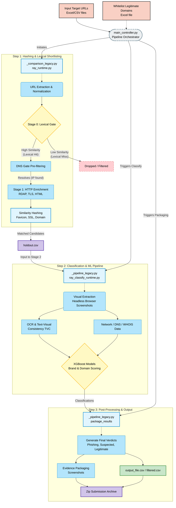

# Phishing Detection Pipeline Architecture

This flowchart outlines the architecture and data flow of the `phishing_ml` pipeline following the removal of legacy compatibility facades (`pipeline.py`, `comparison.py`, `shortlisting.py`). It details how `main_controller.py` orchestrates the process.

