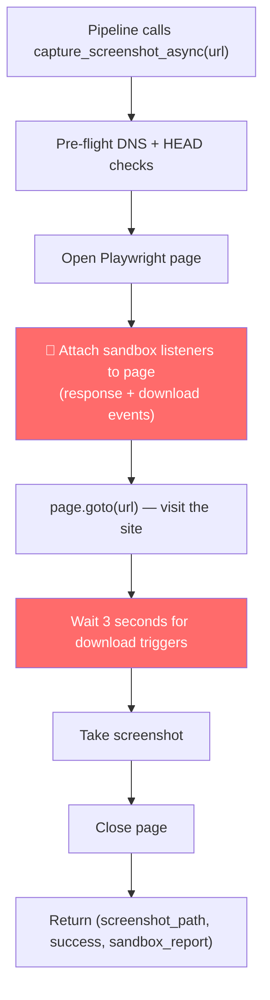

# Sandbox Integration — Detailed Plan

## The Problem

Your pipeline already opens a **headless Chromium browser** to visit each URL and take a screenshot ([capture_screenshot_async](file:///c:/Users/SATWIK/Documents/Phishing/phishing_pipeline/visual_features.py#327-407) in [visual_features.py](file:///c:/Users/SATWIK/Documents/Phishing/phishing_pipeline/visual_features.py)). When the browser visits a malicious URL, it might:

- Trigger a **.apk download**
- Serve a **malicious Office document** (PowerPoint, Word)
- Serve a **ZIP file** or other binary payload

Right now, the pipeline has **no way to detect this** — it just takes the screenshot and moves on.

## The Solution: Add Sandbox Detection INTO the Screenshot Step

Instead of opening a **second browser** to check URLs (slow, wasteful), we add the sandbox detection logic **inside the same browser visit** that takes screenshots.

### How it works today (before change)

```
Browser opens URL → takes screenshot → closes page → done
```

### How it will work (after change)

```
Browser opens URL → LISTENS for malicious downloads/MIME types
                  → takes screenshot
                  → returns screenshot + sandbox verdict
                  → closes page → done
```

**Same browser. Same visit. Zero extra overhead.**

---

## What Exactly Changes

### Step-by-step flow



The red boxes are the **only new things**. Everything else is exactly as before.

---

## Files We Create/Modify

### 1. [NEW] `phishing_pipeline/sandbox.py` — sandbox detection logic

This is a small helper module (~60 lines). It provides one function:

```python
def attach_sandbox_listeners(page) -> dict:
    """
    Attaches response + download listeners to a Playwright page.
    Returns a report dict that gets updated in real-time as
    the page loads and receives responses.
    
    The report dict:
    {
        "sandbox_verdict": "SAFE" | "NOT SAFE" | "INCONCLUSIVE",
        "sandbox_reason": "Clean" | "Malicious Payload Detected: ..." | ...,
        "sandbox_status_code": 200,
        "sandbox_details": []
    }
    """
```

**This is your exact [sandbox_pro.py](file:///c:/Users/SATWIK/Downloads/sandbox_pro.py) detection logic**, just restructured:

- Same malicious indicators: `powerpoint, officedocument, zip, octet-stream, download, attachment`  
- Same download event detection
- Same HTTP status code check
- **No changes to the detection logic at all**

---

### 2. [MODIFY] [visual_features.py](file:///c:/Users/SATWIK/Documents/Phishing/phishing_pipeline/visual_features.py) — use sandbox during screenshot

We modify [capture_screenshot_async()](file:///c:/Users/SATWIK/Documents/Phishing/phishing_pipeline/visual_features.py#327-407) to:

1. Import and call `attach_sandbox_listeners(page)` before `page.goto()`
2. Add a 3-second wait after page load (same as your sandbox script) to catch delayed downloads
3. Return the sandbox report alongside the screenshot result

**Changes to [capture_screenshot_async](file:///c:/Users/SATWIK/Documents/Phishing/phishing_pipeline/visual_features.py#327-407):**

```diff
 # Current: returns (url, success_flag)
-async def capture_screenshot_async(url, out_file, ...) -> tuple[str, bool]:
+async def capture_screenshot_async(url, out_file, ...) -> tuple[str, bool, dict]:

   # ... pre-flight checks (unchanged) ...

   page = await context.new_page()
   
+  # 🔬 Attach sandbox malware detection listeners
+  from .sandbox import attach_sandbox_listeners
+  sandbox_report = attach_sandbox_listeners(page)
   
   await page.goto(target, timeout=5000, wait_until='domcontentloaded')  # ← unchanged!
+  await page.wait_for_timeout(3000)  # 3s wait to catch delayed downloads
   await page.screenshot(path=out_file, full_page=True)
   
+  # Finalize sandbox check
+  finalize_sandbox_report(sandbox_report, target)
   
-  return target, True
+  return target, True, sandbox_report
```

> [!NOTE]
> **Speed impact is minimal.** The page load timeout stays at **5 seconds** (unchanged). We only add a **3-second wait** after load to catch delayed download triggers. So max time per URL = 5s load + 3s wait = **8 seconds worst case**. In practice, most pages load in 1-2 seconds, so real time per URL is **~4-5 seconds**. And since your pipeline runs **multiple screenshots in parallel** (`MAX_CONCURRENT_SCREENSHOTS` workers), the 3s wait overlaps across URLs.

---

### 3. [MODIFY] [pipeline.py](file:///c:/Users/SATWIK/Documents/Phishing/phishing_pipeline/pipeline.py) — pass sandbox report through the pipeline

In [stage1_worker()](file:///c:/Users/SATWIK/Documents/Phishing/phishing_pipeline/pipeline.py#412-450) (line ~412), the sandbox report is added to the feature dict so it flows into the final CSV as two new columns:

```diff
 # In stage1_worker, after screenshot:
 row_meta = {
     "Cooresponding CSE": row.get("Cooresponding CSE", ""),
     "Legitimate Domains": row.get("Legitimate Domains", ""),
+    "Sandbox Verdict": sandbox_report.get("sandbox_verdict", "INCONCLUSIVE"),
+    "Sandbox Reason": sandbox_report.get("sandbox_reason", "Not scanned"),
 }
```

In [_process_single_domain_phase2()](file:///c:/Users/SATWIK/Documents/Phishing/phishing_pipeline/pipeline.py#790-958) (line ~933), we pass them into the final record:

```diff
 record = {
     ...all existing fields...
+    "Sandbox Verdict": feat_row.get("Sandbox Verdict", "INCONCLUSIVE"),
+    "Sandbox Reason": feat_row.get("Sandbox Reason", "Not scanned"),
     "Remarks": "NA values are due to privacy issues.",
 }
```

**No other changes to pipeline logic.** The sandbox data just flows through as extra fields.

---

### 4. [MODIFY] [utils.py](file:///c:/Users/SATWIK/Documents/Phishing/phishing_pipeline/utils.py) — no changes needed

Since we're using the **same browser** and **same concurrency** (no extra tabs/browsers), we don't need new concurrency constants.

---

## Summary of All Changes

| File | What changes | Lines added/changed |
|------|-------------|-------------------|
| `sandbox.py` | **NEW** — sandbox detection logic | ~60 lines (new file) |
| [visual_features.py](file:///c:/Users/SATWIK/Documents/Phishing/phishing_pipeline/visual_features.py) | Attach listeners + 3s wait in screenshot function | ~10 lines added |
| [pipeline.py](file:///c:/Users/SATWIK/Documents/Phishing/phishing_pipeline/pipeline.py) | Pass sandbox fields through stage1 → phase2 → output | ~6 lines added |

**Total: ~76 lines added, ~4 lines modified. Core logic untouched.**

---

## Why This Approach?

| Approach | Pros | Cons |
|----------|------|------|
| ❌ Separate Phase 3 (new browser) | Complete isolation | Opens 2nd browser = slow, wasteful, double RAM |
| ❌ Pre-filter before screenshots | Blocks malware early | Opens 2nd browser = same problem |
| ✅ **Integrate into screenshot visit** | Zero extra overhead, same browser | Slightly longer per-URL (3s wait) |

The 3-second wait per URL is the only "cost", and it runs **in parallel** across all concurrent screenshot workers (your existing `MAX_CONCURRENT_SCREENSHOTS`), so the real-world impact is minimal.

---

## What the Output Looks Like

Your [output_file.csv](file:///c:/Users/SATWIK/Documents/Phishing/phishing_pipeline/output_file.csv) will have these two new columns:

| Domain | ... | Sandbox Verdict | Sandbox Reason |
|--------|-----|----------------|----------------|
| evil-sbi-login.xyz | ... | NOT SAFE | Malicious Payload Detected: application/zip |
| fake-hdfc.com | ... | SAFE | Clean |
| blocked-site.net | ... | INCONCLUSIVE | Timeout or Blocked by Server |

---

## Prerequisites

Same as before — your pipeline already uses Playwright. You just need `playwright-stealth` if not already installed:

```
pip install playwright-stealth
```
